Description
-------
BELLATRIX chatbot is designed to speed up troubleshooting and bring team communication to a new level.

- Failing Test Reason Prediction with Machine Learning
- Comprehensive Test Report for Failing Tests
- Test Runs and Tests Performance Reports
- Notifications: Bugs, Test Runs
- Codeless Test Execution of Auto-generated Test Cases
- Search Documentation and other Test Automation Blogs
- Communicated with our Support Team through the Chatbot
- Help

Once you purchase a chatbot user or receive one purchasing some of our other enterprise add-ons, we will send you an email with instructions on how to add the bot the different chat platforms such as Skype, Skype for Business, Microsoft Teams, Facebook Messenger, Slack, and others. We will ask you for information that we will use to prepare your company and personal accounts within our systems.

Authentication
--------------
First you will be prompted to authenticate. In most cases you will use your working email and setup password the first time. The whole log-in experience is happening through Microsoft Graph authentication system which brings high-class security and features.

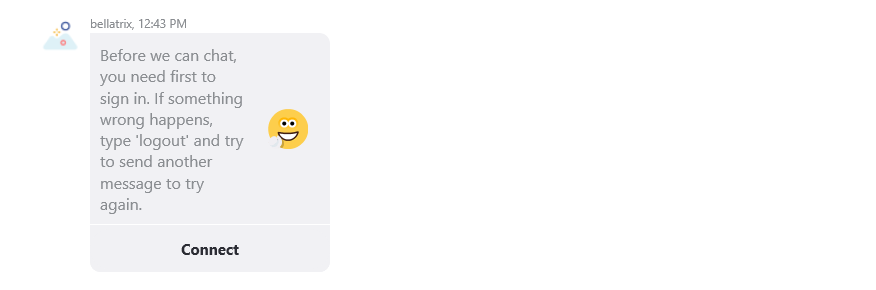

When you click connect the Microsoft log-in form will show up.

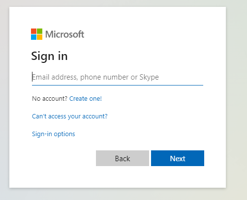

If the authentication is successful you will receive a validation code that you need to copy and paste into the bot chat.

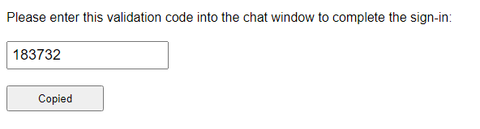
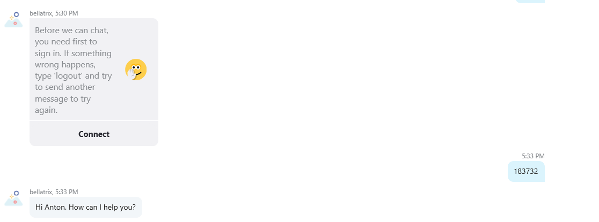

If you want to logout just use the command '**logout**'.

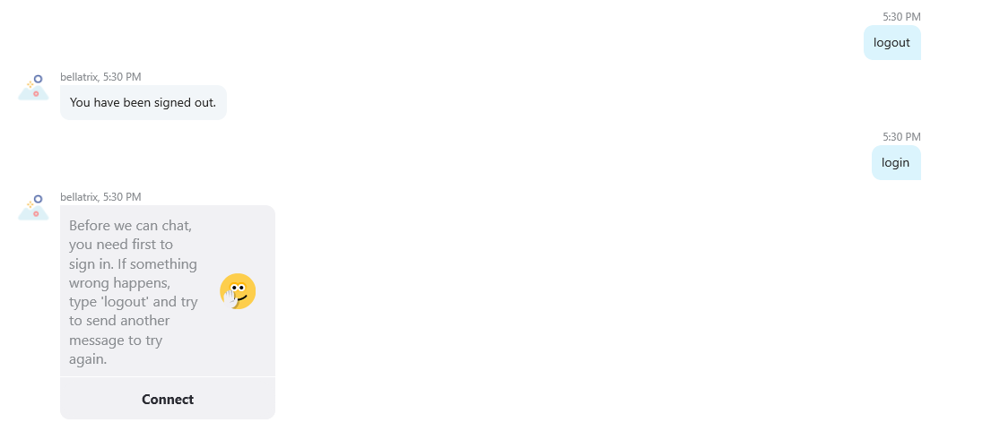

Receive Help
------------
```
can you help me?
help
help me
```
The first time you logged in, you will receive the help. But in case you want BELLATRIX bot to remind you of the instructions, you can use phrases like the above.
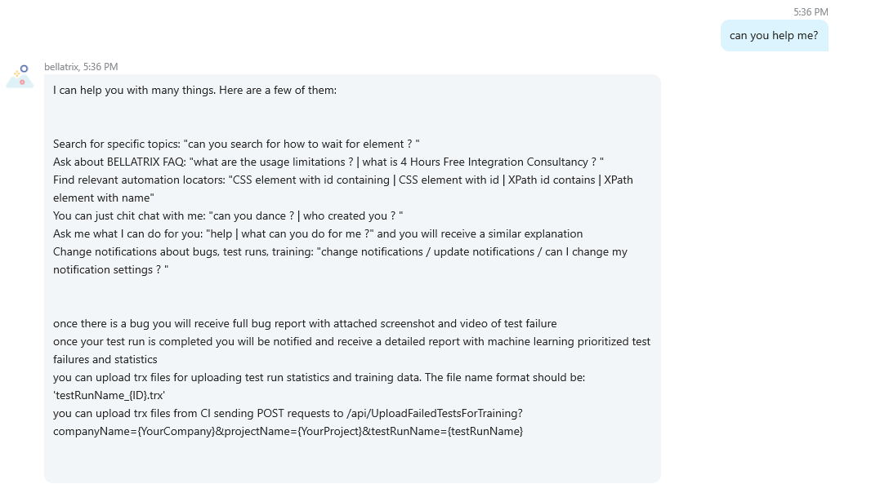

Search for Specific Topic
-------------------------
You write search queries directly in the chat. BELLATRIX will search our and other popular websites about test automation and send you the most relevant pages.
```
can you help me?
help
help me
```
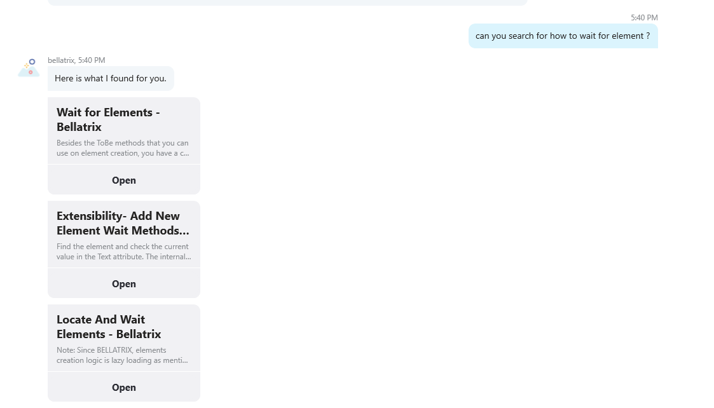

You can also ask the bot about any FAQ about our offerings.

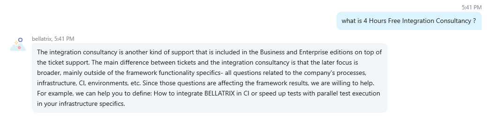


Automated Tests Writing Assistance
----------------------------------
You can ask the chatbot about CSS or XPATH locators, and it will help you. Also, it can give you a hand with other test automation questions.
```
XPath id contains
what is the locator for CSS element with id containing?
locator XPath element with name
```

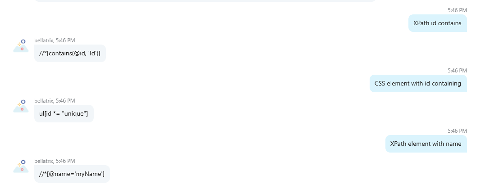

Bug Notifications
-----------------
```
can you change my notifications?
change my notifications
```
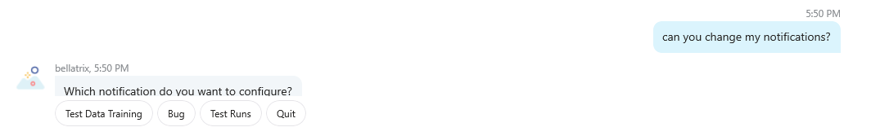

You can subscribe to receive bug report notifications in case of test failure.

Afterward you need to install our add-on NuGet package called **Bellatrix.BugReporting.Bot**. Add the following line to your **TestInitialize.cs** file.
```
app.UseBotBugReporting();
```
Also, you will need an additional section in the BELLATRIX configuration where you will specify information about your company and project. This will instruct BELLATRIX to notify all subscribed users part of this company and project.
```
"bugReportingSettings": {
  "isEnabled": "true",
  "url": "http://localhost:3978/",
  "authorizationToken": "24dd9565-asec-488e-93d0-fc770f4cc752",
  "projectName": "Bellatrix",
  "companyName": "AutomateThePlanet"
},
```

Test Run Completion Notifications
---------------------------------
```
can you change my notifications?
change my notifications
```

Also, you can subscribe to receive notifications about completed test runs. There are two cases where you can use this feature. The first one is if you use our BELLATRIX Cloud Test Runner. If you don't use our runner, you can still use our Machine Learning Analysis report. To do so, you need to send a POST request to upload your test results. Usually, this is done in your CI job on test run completion.

```
/api/UploadFailedTestsForTraining?companyName={YourCompany}&projectName={YourProject}&testRunName={testRunName}
```
The file name format should be: 'testRunName_{ID}.trx'.

Our chatbot will collect history information about your test runs and notify you if some tests are getting slower. The report includes overview information for the test run as duration, passed, and failed tests count. As well as detailed test run results grouped in the following categories:
- Newly Failed
- All Failed
- Slower than Last Run
- Slower than Avg

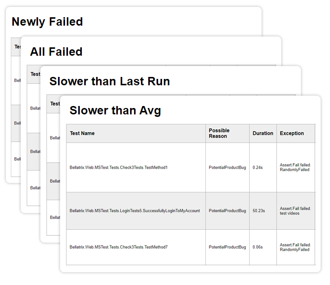

Our Machine Learning algorithm will automatically suggest which tests you should look at first, categorizing them by priority. First, you will see the potential system bugs. This will decrease the time of bug reporting and help you to stabilize your product faster.
- Potential Product Bug
- Test Environment Issue
- Core Library Issue
- Framework Issue
- Test Initialization Issue
- Test Cleanup Issue

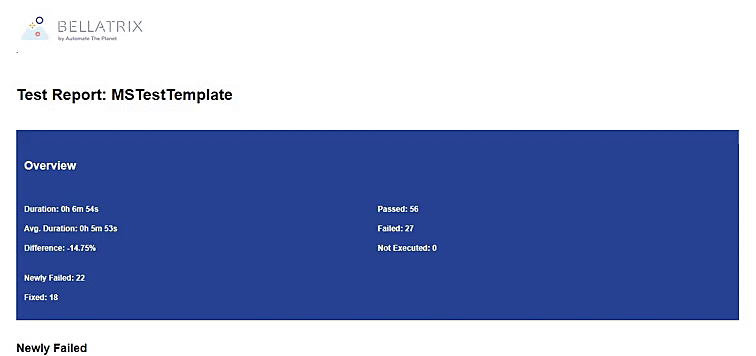