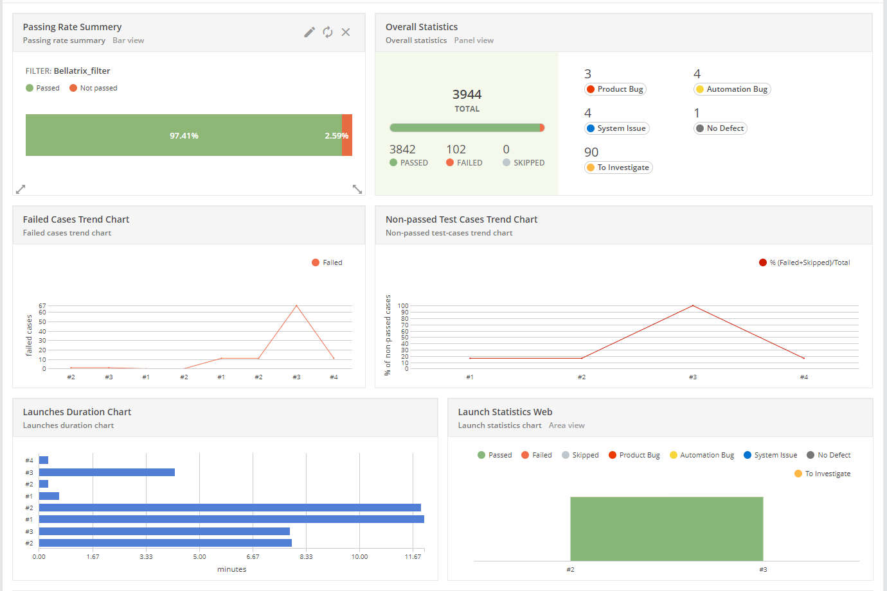
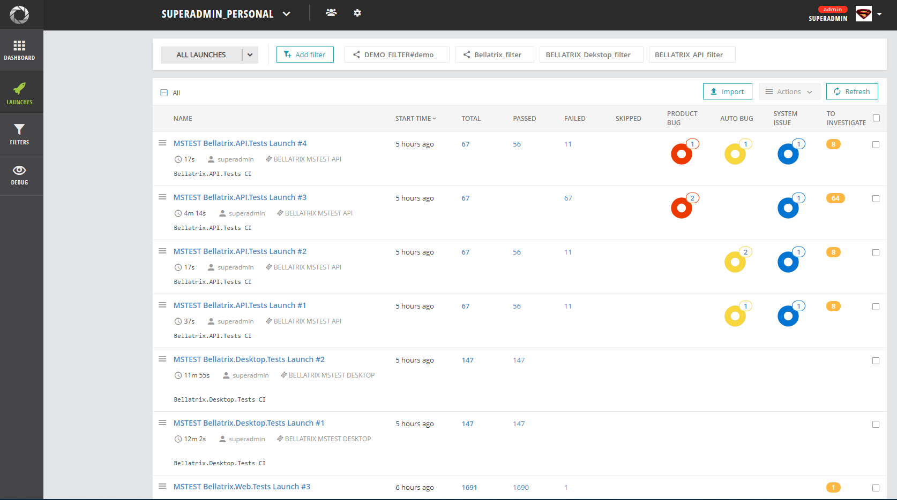
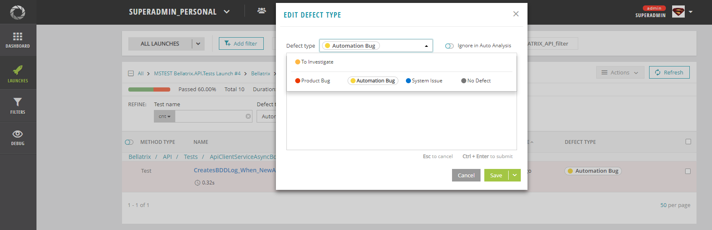
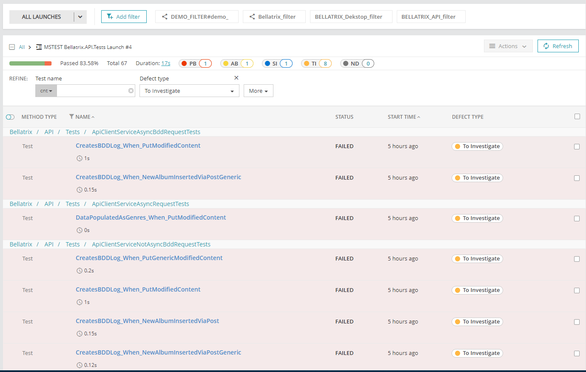

Installation
-------
When you purchase a company license for the standalone runner, you will receive access to a GitHub repository with the full source code. Afterward, you can build and use the runner.
Usage
-------
```
bellatrixstandalonetestrunner --library="C:\SourceCode\BELLATRIX\Tests\Bellatrix.Web.Tests\bin\Debug\netcoreapp3.1\Bellatrix.Web.Tests.dll" --results="C:\SourceCode\BELLATRIX\Tests\Bellatrix.Web.Tests\bin\Debug\netcoreapp3.1\ciwebresults.trx" --maxCount=4  --retries=2 --threshold=60 --reportPortalProject="bellatrix" --reportPortalAccessToken="asdgr435-66f5-44a3-ghjh5-7956895814ed" --reportPortalUrl="http://myreportportal.com:8080" --reportPortalLaunchName="CIWebTests" --filter="test.FullName.Contains(\"ColorControlBddLoggingTests\")"
```
Commands
-------
```
--library="pathToBuildedFiles\SampleTestProj.dll"
```
Path to the DLL that includes your tests. Make sure all referenced assemblies to be copied to the same folder.
To make sure that this happens, add the following line to your MSBuild project:
```
<PropertyGroup>
  <CopyLocalLockFileAssemblies>true</CopyLocalLockFileAssemblies>
</PropertyGroup>
```
```
--results="pathToResults\result.trx
```
The path where the results produced by the runner will be saved. The file should be in the expected file format. TRX is the file format for .NET tests. If the retry option is turned-on the produced results will be updated automatically.
```
--filter="test.FullName != \"TestName\" AND !test.Categories.Contains(\"CI\")"
```
BELlATRIX Standalone Test Runner has a built-in complex test filter parser, and we can write complex queries to filter the tests.
```
--retries=3 --threshold=20
```
With this one, we tell the runner to retry the failed tests three times if less than 20% of all tests have failed.
```
--maxCount=4
```
Instructs the runner to execute the tests in 4 separate processes. By default, the tests are split by test count. **Keep in mind that tests in one test class will always be executed sequentially on the same thread!**
```
--reportPortalProject="bellatrix" --reportPortalAccessToken="asdgr435-66f5-44a3-ghjh5-7956895814ed" --reportPortalUrl="http://myreportportal.com:8080" --reportPortalLaunchName="CIWebTests"
```
The results are sent to your **[ReportPortal](https://reportportal.io/)** instance. You need to provide the name of your project, and the launch name later used to group your tests. Also, you need to provide a URL to your instance and an access token used for login. You can generate one from your **[ReportPortal](https://reportportal.io/)** profile. In the following section, you can read more about **[ReportPortal](https://reportportal.io/)**.

Additional Notes
-------
By default for BELLATRIX Web, Android, iOS, Desktop modules the runner switches automatically all app/browser behaviors to **RestartEveryTime**.
```
[App(Constants.WpfAppPath, AppBehavior.RestartEveryTime)]
[Browser(BrowserType.Chrome, BrowserBehavior.RestartEveryTime)]
```
This is needed so that all apps and browsers ran in parallel to be correctly closed. Otherwise, you risk lots of them remaining open at the end of the run. Because of this automatic behavior, if you use logic inside **TestsAct** or **TestsArrange** methods to perform operations against your app, your website, in case of parallel run, you risk experiencing unexpected errors. Preferably execute such logic inside the **TestInit** method.
```
public override void TestsArrange()
{
    _mainButton = App.ElementCreateService.CreateByName<Button>("E Button");
    _resultsLabel = App.ElementCreateService.CreateByAutomationId<Label>("ResultLabelId");
}

public override void TestsAct()
{
    _mainButton.Hover();
}
```
By default, in parallel-run mode, the BELLATRIX video recording is turned off.

What is ReportPortal?
-------
**[ReportPortal](http://reportportal.io/)** is a service, that provides increased capabilities to speed up results analysis and reporting through the use of built-in analytic features. ReportPortal is a great addition to the Continuous Integration and Continuous Testing process.

The tool gives you the capability to create custom dashboards. I have created a dashboard visualizing the data from our latest BELLATRIX test runs. The first one shows the passing rate of all tests. The next one displays overall statistics- how many tests were executed and various types of bugs after the investigation process. Bellow, you can find some trend charts between runs. Also, there are some nice widgets for making a comparison between the test runs duration. 



There are widgets that display the latest runs flaky tests and the tests that most failed. It is a neat feature for stabilizing these tests.


In the Launches section, you can see the latest runs and filter them.



When you open a failed tests it initially is set that it needs investigation after that you can mark it as Product Bug, Automation Bug or System issue like a problem in the test environment.



All test failure info is synced automatically and well displayed.


You can filter based on the bug type and check all of these tests.

