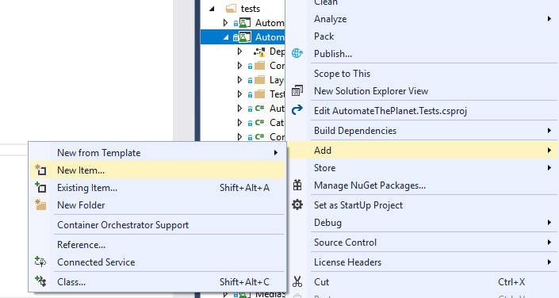

Introduction
------------
As you most probably noticed this is like the 4th time we use almost the same elements and logic inside our tests. Similar test writing approach leads to unreadable and hard to maintain tests. Because of that people use the so-called Page Object design pattern to reuse their elements and pages' logic. BELLATRIX comes with powerful built-in page objects which are much more readable and maintainable than regular vanilla WebDriver ones.

Non-page-object Test Example
----------------------------
```csharp
[TestMethod]
public void ActionsWithoutPageObjects()
{
    var button = App.ElementCreateService.CreateByIdContaining<Button>("button");
    button.EnsureIsNotDisabled();
    var checkBox = App.ElementCreateService.CreateByIdContaining<CheckBox>("check1");
    checkBox.Check();
    checkBox.EnsureIsChecked();
    var comboBox = App.ElementCreateService.CreateByIdContaining<ComboBox>("spinner1");
    comboBox.SelectByText("Jupiter");
    comboBox.EnsureTextIs("Jupiter");
    var label = App.ElementCreateService.CreateByText<Label>("textColorPrimary");
    label.EnsureIsVisible();
    var radioButton = App.ElementCreateService.CreateByIdContaining<RadioButton>("radio2");
    radioButton.Click();
    radioButton.EnsureIsChecked(timeout: 30, sleepInterval: 2);
}
```

How to Create BELLATRIX Page Object
-----------------------------------
To create a new page object, you have a couple of options. You can create it manually. However, why wasting time? BELLATRIX comes with ready-to-go page object templates. How to create a new page object?
- Create a new folder for your page and name it properly.
- Open the context menu and click 'New Item...'



- Choose one of the 4 Android page objects templates
**Bellatrix-AssertedAndroidPage** - contains 3 files- one for actions, one for element declarations and one for assertions (all of them make one-page object).
**Bellatrix-AndroidPage**- one for actions and one for elements (all of them make a one-page object), don't have methods for navigation.
**Bellatrix-AndroidAssertedNavigatablePage**- one for actions and one for elements (all of them make a one-page object), one for assertions and contains methods for navigating to specific activity.
**Bellatrix-AndroidNavigatablePage**- one for actions and one for elements (all of them make a one-page object) and contains methods for navigating to specific activity.


The files are generated.


On most pages, you need to define elements. Placing them in a single place makes the changing of the locators easy. It is a matter of choice whether to have action methods or not. If you use the same combination of same actions against a group of elements then it may be a good idea to wrap them in a page object action method. In our example, we can wrap the transfer of an item in such a method.
In the assertions file, we may place some predefined ensure methods. For example, if you always check the same email or title of a screen, there is no need to hard-code the string in each test. Later if the title is changed, you can do it in a single place. The same is true about most of the things you can assert in your tests.

Page Object Example
-------------------
### Methods File ###
```csharp
public partial class MainAndroidPage : AssertedNavigatablePage
{
    public void TransferItem(string itemToBeTransferred, string userName, string password)
    {
        PermanentTransfer.Check();
        Items.SelectByText(itemToBeTransferred);
        ReturnItemAfter.ToNotExists().WaitToBe();
        UserName.SetText(userName);
        Password.SetPassword(password);
        KeepMeLogged.Click();
        Transfer.Click();
    }

    protected override string ActivityName => ".view.Controls1";
    protected override string PackageName => Constants.AndroidNativeAppAppExamplePackage;
}
```
### Elements File ###
```csharp
public partial class MainAndroidPage
{
    public Button Transfer => Element.CreateByIdContaining<Button>("button");
    public CheckBox PermanentTransfer => Element.CreateByIdContaining<CheckBox>("check1");
    public ComboBox Items => Element.CreateByIdContaining<ComboBox>("spinner1");
    public Button ReturnItemAfter => Element.CreateByIdContaining<Button>("toggle1");
    public Label Results => Element.CreateByText<Label>("textColorPrimary");
    public Password Password => Element.CreateByIdContaining<Password>("edit2");
    public TextField UserName => Element.CreateByIdContaining<TextField>("edit");
    public RadioButton KeepMeLogged => Element.CreateByIdContaining<RadioButton>("radio2");
}
```
### Assertions File ###
```csharp
public partial class MainAndroidPage
{
    public void AssertPermanentTransferIsChecked()
    {
        Assert.IsTrue(PermanentTransfer.IsChecked);
    }

    public void AssertRightItemSelected(string itemName)
    {
        Assert.AreEqual(itemName, Items.GetText());
    }

    public void AssertRightUserNameSet(string userName)
    {
        Assert.AreEqual(userName, UserName.GetText());
    }

    public void AssertKeepMeLoggedChecked()
    {
        Assert.IsTrue(KeepMeLogged.IsChecked);
    }
}
```

Page Object Example Explanations
--------------------------------
```csharp
public partial class MainAndroidPage : AssertedNavigatablePage
```
All BELLATRIX page objects are implemented as partial classes which means that you have separate files for different parts of it- actions, elements, assertions but at the end, they are all built into a single type. This makes the maintainability and readability of these classes much better. Also, you can easier locate what you need. You can always create BELLATRIX page objects yourself inherit one of the 4 classes- Page, AssertedPage, NavigatablePage, AssertedNavigatablePage. We advise you to follow the convention with partial classes, but you are always free to put all pieces in a single file.
```csharp
public void TransferItem(string itemToBeTransferred, string userName, string password)
{
    PermanentTransfer.Check();
    Items.SelectByText(itemToBeTransferred);
    ReturnItemAfter.ToNotExists().WaitToBe();
    UserName.SetText(userName);
    Password.SetPassword(password);
    KeepMeLogged.Click();
    Transfer.Click();
}
```
These elements are always used together when an item is transferred. There are many test cases where you need to transfer different items and so on. This way you reuse the code instead of copy-paste it. If there is a change in the way how the item is transferred, change the workflow only here. Even single line of code is changed in your tests.
```csharp
protected override string ActivityName => ".view.Controls1";
protected override string PackageName => Constants.AndroidNativeAppAppExamplePackage;
```
We use these values later to navigate to the page's activity.
```csharp
public Button Transfer => Element.CreateByIdContaining<Button>("button");
```
All elements are placed inside the file **PageName.Elements** so that the declarations of your elements to be in a single place. It is convenient since if there is a change in some of the locators or elements types you can apply the fix only here. All elements are implements as properties. Here we use the short syntax for declaring properties, but you can always use the old one. **Elements** property is actually a shorter version of **ElementCreateService**.
```csharp
public void AssertPermanentTransferIsChecked()
{
    Assert.IsTrue(PermanentTransfer.IsChecked);
}
```
With this Assert, reuse the formatting of the currency and the timeout. Also, since the method is called from the page it makes your tests a little bit more readable.If there is a change what needs to be checked --> for example, not span but different element you can change it in a single place.

Page Object Test Example
------------------------
```csharp
[TestMethod]
public void ActionsWithPageObjects()
{
    var mainPage = App.Create<MainAndroidPage>();

    mainPage.GoTo();

    mainPage.TransferItem("Item2", "bellatrix", "topsecret");

    mainPage.AssertKeepMeLoggedChecked();
    mainPage.AssertPermanentTransferIsChecked();
    mainPage.AssertRightItemSelected("Item2");
    mainPage.AssertRightUserNameSet("bellatrix");
}
```

Page Object Test Example Explanations
-------------------------------------
```csharp
var mainPage = App.Create<MainAndroidPage>();
```
You can use the App Create method to get an instance of it.
```csharp
mainPage.GoTo();
```
Opens the page's Android activity screen.
```csharp
mainPage.TransferItem("Item2", "bellatrix", "topsecret");
```
After you have the instance, you can directly start using the action methods of the page. As you can see the test became much shorter and more readable. The additional code pays off in future when changes are made to the page, or you need to reuse some of the methods.