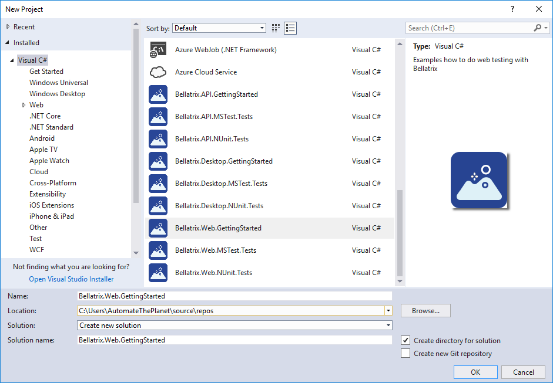
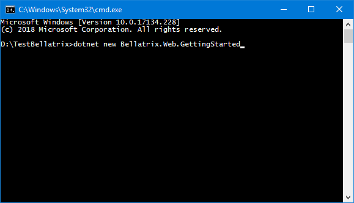

Create Projects from Visual Studio
----------------------------------
You can use built-in Visual Studio templates to create BELLATRIX test projects.
From **File -> New -> Project** you can find all BELLATRIX projects too




Create Projects from CLI
------------------------
You can create an empty tests project with all required files through dotnet CLI
1. Open CMD
2. Using the command "dotnet new -l" you can see all available templates 

Before you can create a new project, you need to install the BELLATRIX template first.

**All available templates:**

- Bellatrix.API.GettingStarted
- Bellatrix.API.MSTest.Tests
- Bellatrix.API.NUnit.Tests
- Bellatrix.Desktop.GettingStarted
- Bellatrix.Desktop.MSTest.Tests
- Bellatrix.Desktop.NUnit.Tests
- Bellatrix.Web.GettingStarted
- Bellatrix.Web.MSTest.Tests
- Bellatrix.Web.NUnit.Tests
- Bellatrix.Mobile.Android.GettingStarted
- Bellatrix.Mobile.Android.MSTest.Tests
- Bellatrix.Mobile.Android.NUnit.Tests
- Bellatrix.Mobile.IOS.GettingStarted
- Bellatrix.Mobile.IOS.MSTest.Tests
- Bellatrix.Mobile.IOS.NUnit.Tests

**Install Template**

```
dotnet new -i Bellatrix.Mobile.Android.GettingStarted
```

**Create Project from Template**
1. Open the folder where you want the files to be placed
2. Open CMD
3. Type the bellow command for the desired template

```
dotnet new Bellatrix.Mobile.Android.GettingStarted
```

