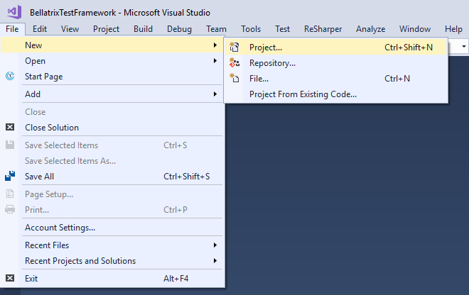
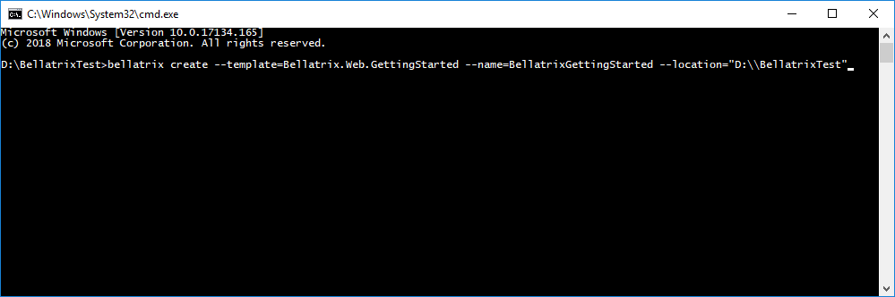

Create Projects from Visual Studio
----------------------------------
You can use built-in Visual Studio templates to create Bellatrix test projects.
From **File -> New -> Project** you can find all Bellatrix projects too




Create Projects from CLI
------------------------
You can create an empty tests project with all required files through bellatrix CLI
1. Open CMD
2. Using the command "bellatrix listTemplates" you can see all available templates 
3. Create an empty project depending on the desired unit test framework and technology

```
bellatrix create --template=Bellatrix.Desktop.MSTest.Tests --name=YourProjectsName --location="PathWhereToCreate"
```



**All available templates:**

- Bellatrix.API.GettingStarted
- Bellatrix.API.MSTest.Tests
- Bellatrix.API.NUnit.Tests
- Bellatrix.Desktop.GettingStarted
- Bellatrix.Desktop.MSTest.Tests
- Bellatrix.Desktop.NUnit.Tests
- Bellatrix.Web.GettingStarted
- Bellatrix.Web.MSTest.Tests
- Bellatrix.Web.NUnit.Tests