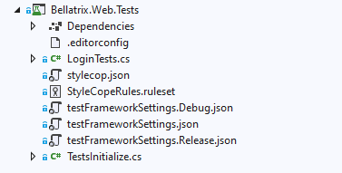
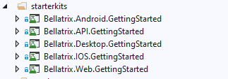

Overview
--------
BELLATRIX is not a single thing it contains multiple framework libraries, extensions and tools. The tool is built to be cross-platform.

Simple Installation
------------------
1. Download the BELLATRIX
2. Unzip it. Open BellatrixTestFramework.sln in Visual Studio 
3. Open one of the preconfigured projects. It works for both MSTest and NUnit without additional configuration.



4. Run the sample tests.
5. You can try to write a simple test yourself.
6. For an in-depth revision of all framework features you can open the getting started projects.


Running Tests through CLI
--------------------------
 To execute your tests via command line in Continues Integration (CI), you can use the native .NET Core test runner.
1. Navigate to the folder of your test project.
2. Open the CMD there.
3. Execute the following command:

```
dotnet test
```
For applying filters and other more advanced configuration check the official documentation [https://docs.microsoft.com/en-us/dotnet/core/tools/dotnet-test](https://docs.microsoft.com/en-us/dotnet/core/tools/dotnet-test "dotnet test") and [https://docs.microsoft.com/en-us/dotnet/core/tools/dotnet-vstest](https://docs.microsoft.com/en-us/dotnet/core/tools/dotnet-vstest "dotnet vstest").

Both MSTest and NUnit are supported.
