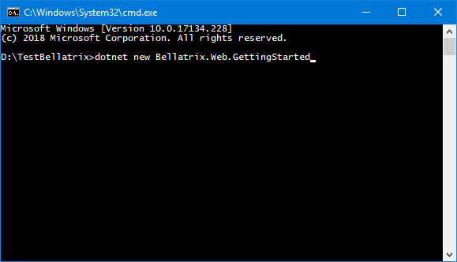

Overview
--------
The starter kits are one of the greatest features of Bellatrix. For each module- web, API, desktop, mobile you have a project containing demos and explanations about each specific of the framework. Moreover, the starter kit contains exercises for you after each chapter. 

Create Starter Kit from Visual Studio
----------------------------------
You can use built-in Visual Studio templates to create Bellatrix test projects.
From **File -> New -> Project** you can find all Bellatrix projects too


Create Starter Kit from CLI
------------------------
You can create an empty tests project with all required files through bellatrix CLI
1. Open CMD
2. Using the command "bellatrix listTemplates" you can see all available templates 
3. Create an empty project depending on the desired unit test framework and technology

```
bellatrix create --template=Bellatrix.Web.GettingStarted --name=YourProjectsName --location="PathWhereToCreate"
```


**All available templates:**

- Bellatrix.Web.GettingStarted
- Bellatrix.API.GettingStarted
- Bellatrix.Desktop.GettingStarted
