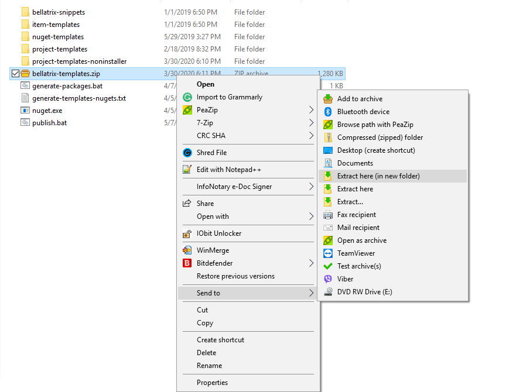

Overview
--------
BELLATRIX is not a single thing it contains multiple framework libraries, extensions and tools.
The recommended code editor for OSX is [**Visual Studio for Mac**](https://visualstudio.microsoft.com/vs/mac/) but you can also use [**Visual Studio Code**](https://code.visualstudio.com/).

> Before proceeding with the installation, please read the [**system requirements**](system-requirements.md) system requirements and **install all prerequisites**!

Simple Installation
------------------
1. Download the BELLATRIX projects zip file from the email you received after the downloading step.
2. Unzip it. The projects are grouped by technology: web, desktop, mobile, API, load testing

3. Open the project based on the test framework you prefer: MSTest or NUnit.

4. Click on the csproj file.

5. Run the sample tests.
6. You can try to write a simple test yourself.
7. For an in-depth revision of all framework features you can open the getting started projects.

[**Getting Started projects**](how-to-use-starter-kits.md) contain examples, demos and exercises. It is recommended to create such a project first and test the BELLATRIX tools and libraries. After that, you can use "Tests" templates which generate empty preconfigured BELLATRIX projects depending on the technology- Web, Desktop, API, MSTest, NUnit.
