Overview
--------
BELLATRIX is not a single thing it contains multiple framework libraries, extensions and tools. The tool is built to be cross-platform, however some of the features can be used under Windows since they are written for Visual Studio.

> Before proceeding with the installation, please read the [**system requirements**](system-requirements.md) system requirements and **install all prerequisites**!

Simple Installation
------------------
1.1. Download the BELLATRIX projects zip file from the email you received after the downloading step.
1.2. Unzip it. The projects are grouped by technology: web, desktop, mobile, API, load testing

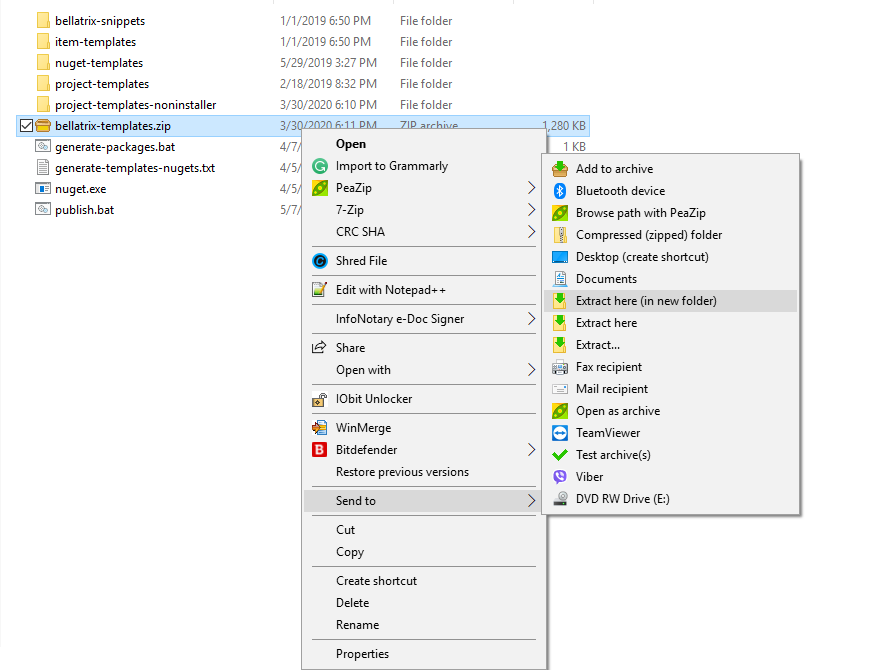

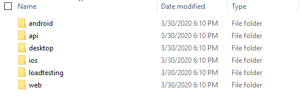

1.3. Open the project based on the test framework you prefer: MSTest or NUnit.

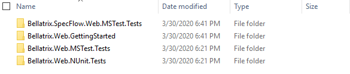

1.4. Click on the csproj file.

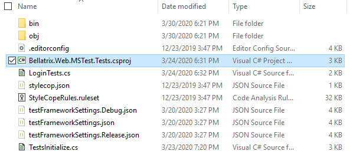

1.5. Run the sample tests.
1.6. You can try to write a simple test yourself.
1.7. For an in-depth revision of all framework features you can open the getting started projects.

- [**Starter Kits**](how-to-use-starter-kits.md)

Installation Steps Visual Studio Integration
------------------
1. Download BELLATRIX UI Installer [**x86 version**](installers/Bellatrix.Installer.UI-1.9.6.0-x86.msi) or [**x64 version**](installers/Bellatrix.Installer.UI-1.9.6.0-x64.msi)
2. Run **Bellatrix.Installer.UI.msi**

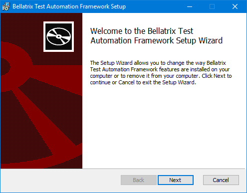

2.1. Click Next

2.2. Accept End-User License Agreement and click Next.

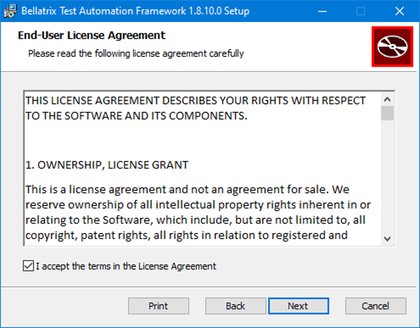

2.3. Select BELLATRIX modules you would like to install and proceed with.

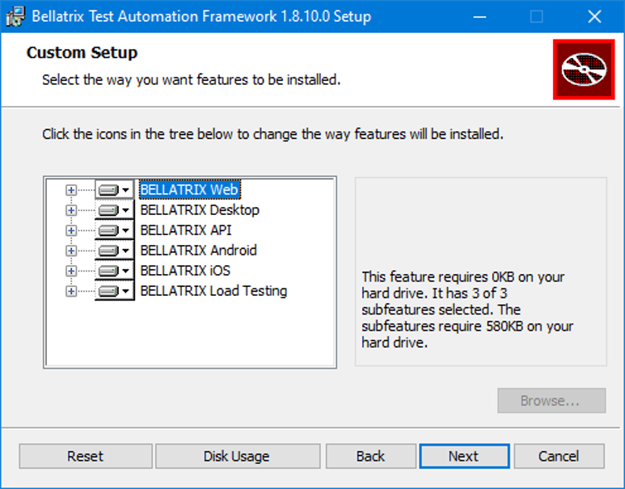

2.4. Click **Install** and agree to run the installer with Administrative permissions.

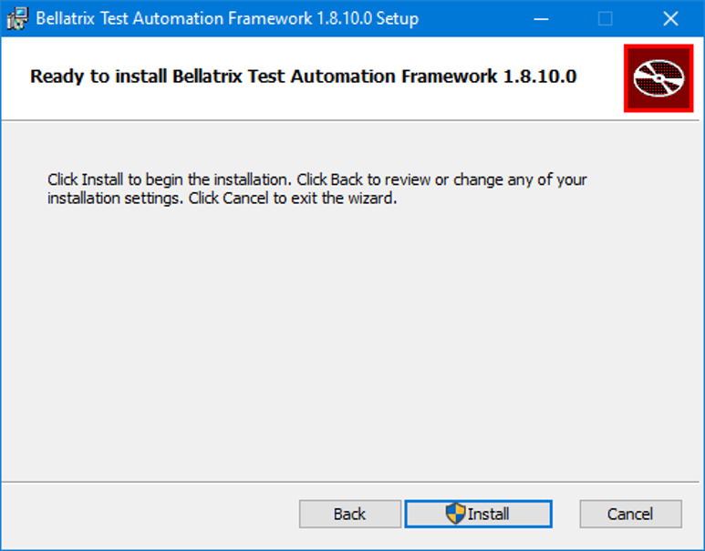

2.5. Wait for the installation to finish.

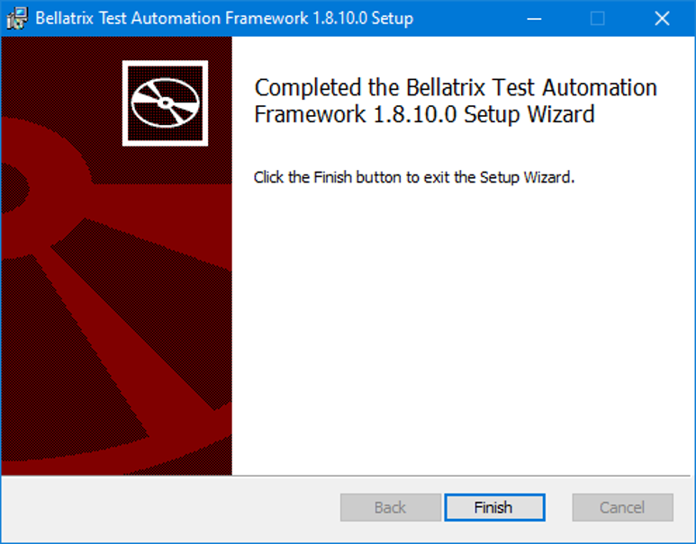

Create a New BELLATRIX Project in Visual Studio
------------------

1.1. Open a New Instance of Visual Studio IDE and Click The Create a New Project Button.

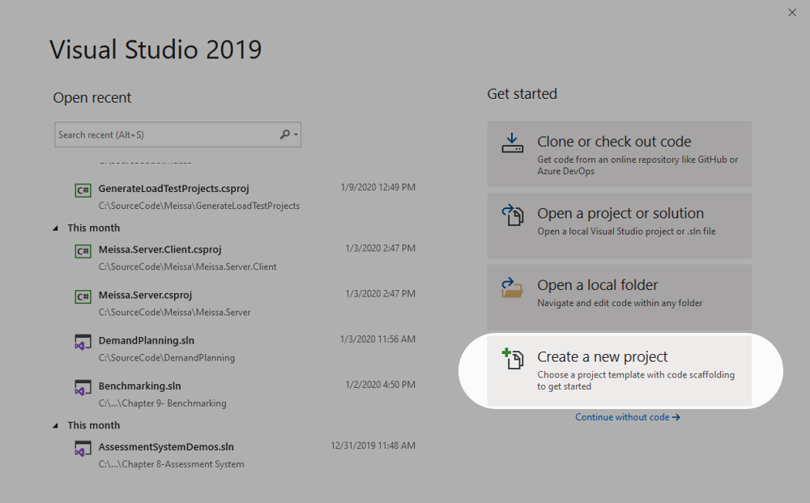

1.2. Search for ‘bellatrix web’.

1.3. Select **Bellatrix.Web.NUnit.Tests** template and click **Next**.

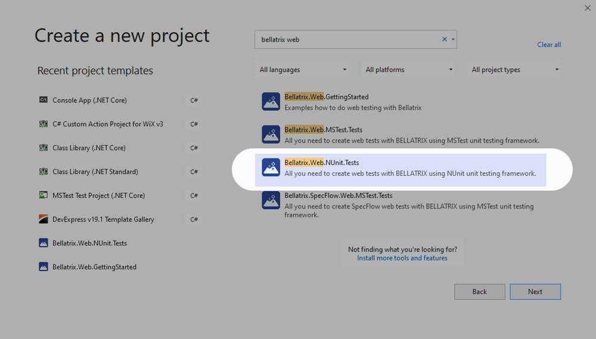

1.4. Choose the location where the project will be created. Set project and solution name. Click **Create**.

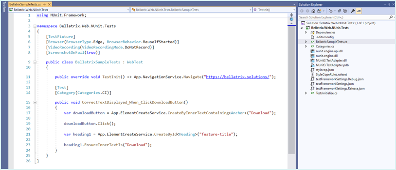

After you install the product, you need to create a starter kit project to see how to use all features or create an empty BELLATRIX tests project. 

Read how to use all installed features:

- [**Starter Kits**](how-to-use-starter-kits.md)
- [**Project Templates**](https://docs.bellatrix.solutions/web-automation/templates)
- [**Element Code Snippets**](https://docs.bellatrix.solutions/web-automation/elements-snippets/)
- [**Page Object Item Templates**](https://docs.bellatrix.solutions/web-automation/page-objects/)

Installation Steps Command Line
-------------------------------------

There are not snippets, item or project templates for Visual Studio Code. The way you create BELLATRIX project is through CLI.

Before you can create a new project, you need to install the template first.

**All available templates:**

- Bellatrix.API.GettingStarted
- Bellatrix.API.MSTest.Tests
- Bellatrix.API.NUnit.Tests
- Bellatrix.Desktop.GettingStarted
- Bellatrix.Desktop.MSTest.Tests
- Bellatrix.Desktop.NUnit.Tests
- Bellatrix.Web.GettingStarted
- Bellatrix.Web.MSTest.Tests
- Bellatrix.Web.NUnit.Tests

**Install Template**

```
dotnet new -i Bellatrix.Web.GettingStarted
```

**Create Project from Template**
1. Open the folder where you want the files to be placed
2. Open CMD
3. Type the below command for the desired template

```
dotnet new Bellatrix.Web.GettingStarted
```

Getting Started projects contain examples, demos and exercises. It is recommended to create such a project first and test the BELLATRIX tools and libraries. After that, you can use "Tests" templates which generate empty preconfigured BELLATRIX projects depending on the technology- Web, Desktop, API, MSTest, NUnit.

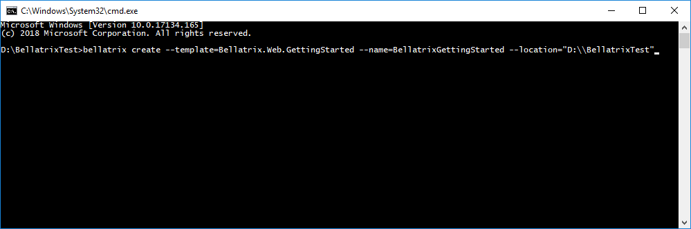

Testing on Remote Machines
--------------------------
To execute your tests on a remote machine or multiple machines you can use Automate the Planet open-source distributed test runner [**Meissa**](https://meissarunner.com).

You can download it from the site. To get started read [**Meissa Docs**](http://docs.meissarunner.com/).
