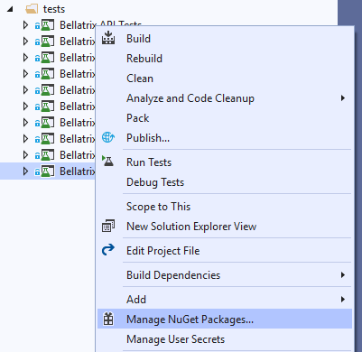
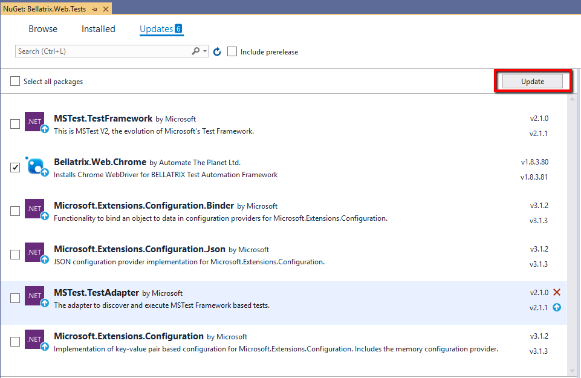

Overview
--------
Every few months, we release new versions of our BELLATRIX libraries and tooling. With every major release, we bring many bug fixes, enhancements, and new features. Here you will find detailed steps how you can keep your BELLATRIX projects up to date.

Simple Update Steps
------------------
The simplest way to update BELLATRIX tools and drivers is to open the NuGet update window in Visual Studio.

1. Open '**Manage NuGet Packages**' window

2. Open the Update tab. Choose the BELLATRIX packages and click **Update**.

To get the latest source code the framework, all new features, bug fixes check your email where you will receive a notification about the new version and how to download it. The above instructions will update only browser drivers, video recording and similar tools but not the framework itself.

Using New Features
--------------------------
Sometimes the simple update of all NuGet packages might not be enough. Some features require specific settings to be present in the **testFrameworkSettings.json** file. Read the documentation about the feature you want to start to use. Add the necessary configuration to your settings files. Also, you may need to add a "use" line in the **TestInitialize.cs** file, which will be again explained in the documentation.

In case you need additional help, you can use our Standard Support, Private GitHub repository, Professional Services add-ons. Otherwise, you can open a new forum thread.
