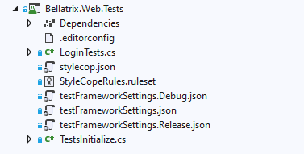

Overview
--------
BELLATRIX is not a single thing, it contains multiple framework libraries, extensions and tools. The tool is built to be cross-platform, however some of the features can be used under Windows since they are written for Visual Studio.

> Before proceeding with the installation, please read the [**system requirements**](system-requirements.md) system requirements and **install all prerequisites**!

Simple Installation
--------
1. Download BELLATRIX file/zip.
2. Unzip it. Open BellatrixTestFramework.sln in Visual Studio.
3. Open one of the preconfigured projects. It works for both MSTest and NUnit without additional configuration.



4. Run the sample tests.
5. You can try to write a simple test yourself.
6. For an in-depth revision of all framework features you can open the getting started projects.


How to use starter kits?
--------
The starter kits are one of the greatest features of BELLATRIX. For each module; web, API, desktop, mobile, you have a project containing demos and explanations about each specific of the framework. Moreover, the starter kit contains exercises for you after each chapter.
1. Download the BELLATRIX projects zip file from the email you received after the downloading step.
2. Unzip it. The projects are grouped by technology: web, desktop, mobile, API.
3. Open the getting started project based on the test framework you prefer.
4. Click on the csproj file.
5. Run the sample tests.
6. You can try to write a simple test yourself.


Release Strategy
--------
**Versioning**

Our project uses [Semantic Versioning](https://semver.org/) (SemVer) for clear and predictable version management. Each release is tagged with a unique version number that reflects the nature of the changes made.

**Tags and Releases**
-   **Tags:** We create Git tags for each release to mark specific points in the project's history, making it easier for users to switch between versions.
-   **Release Notes:** Detailed notes accompany [each release](https://bellatrix.solutions/roadmap/release-3-9-0-0-lyra/), highlighting new features, bug fixes, and any breaking changes.


**Accessing Releases**

Users can access the specific releases directly from our GitHub repository's Releases page or BELLATRIX website's roadmap section. Each release includes a tag, a summary of changes, and assets (if applicable).

Integrating BELLATRIX as a Submodule in Your Project
--------
To leverage a specific version of BELLATRIX in your project, you can add it as a Git submodule. This allows you to keep your copy of BELLATRIX up to date or locked to a specific version, depending on your project's needs.
**Navigate to Your Project Directory:** Open a terminal and change to the directory where your project is located.
**Add BELLATRIX as a Submodule:** Use the following Git command to add BELLATRIX as a submodule to your project:
```
git submodule add https://github.com/BELLATRIX-Library/BELLATRIX.git path/to/submodule
``` 
Replace `path/to/submodule` with the relative path within your project where you'd like the BELLATRIX submodule to reside.
**Initialize and Clone the Submodule:** If you're adding the submodule for the first time, initialize your local configuration file and clone the BELLATRIX repository as follows:
```
git submodule update --init --recursive
```

Checking Out a Specific Tag (Release Version)
--------
After adding BELLATRIX as a submodule, you might want to use a specific release version rather than the latest commit on the main branch.
**Navigate to the Submodule Directory:** Change into the BELLATRIX submodule directory within your project:
```
cd path/to/submodule
```
**Fetch All Tags from the BELLATRIX Repository:** To ensure you have a list of all available tags, fetch them:
```
git fetch --tags
```
**Checkout the Desired Tag:** Check out the specific tag (release version) you want to use by replacing `<tagname>` with the desired version:
```   
git checkout tags/<tagname>` 
```
For example, if you want to check out version `v3.9.0.0`, you would use:
```
git checkout tags/v3.9.0.0
```
**Commit the Submodule Change:** Navigate back to your project's root directory, and commit the change to the submodule reference:
```
cd ../..
git add path/to/submodule
git commit -m "Update BELLATRIX submodule to v3.9.0.0"
```
This process ensures that your project uses a specific, fixed version of BELLATRIX, providing stability and consistency across environments or deployments.