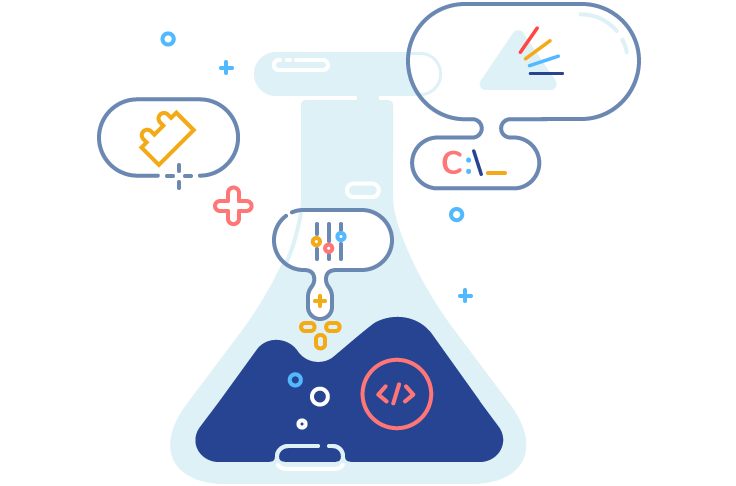
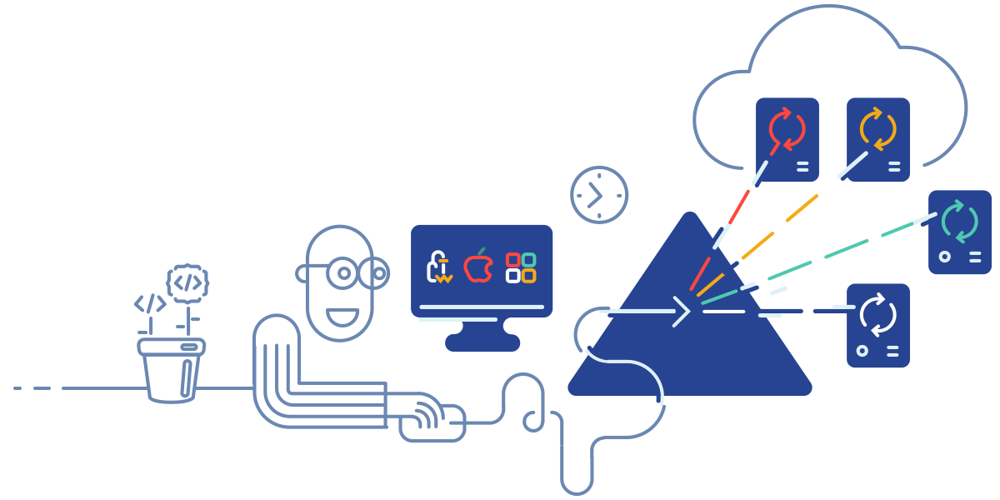

BELLATRIX Test Automation Framework 
---------------------------------------------------------

BELLATRIX is web, desktop, mobile and API test automation framework. It is cross-platform, easily customizable and extensible, increasing tests’ reliability.

In order to deliver seamless user experience, we keep the same structure in the documentation and our Ready-To-Go solution (starting kit).
This documentation will walk you through the process [**installation**](https://docs.bellatrix.solutions/general-information/installation-windows/), explanation How to Use [**Starter Kits**](https://docs.bellatrix.solutions/general-information/how-to-use-starter-kits/). Go to the process of creating your first web desktop or API automated test case. When you are ready you can dive into advanced topics like extendability responsive layouts testing.

Meissa Test Runner
------------------

Our cross-platform distributed test runner that executes tests in parallel, time balanced. Build to extend BELLATRIX capabilities by providing Faster Deployments. Free for the community, find out more [**here**](https://meissarunner.com/)
