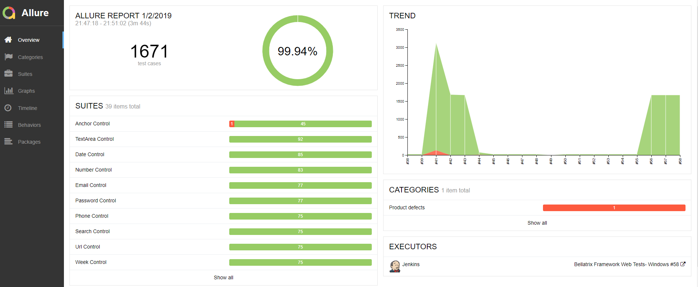

What is Allure?
-------
**[Allure Framework](http://allure.qatools.ru/)** is a flexible lightweight multi-language test report tool that not only shows a very concise representation of what have been tested in a neat web report form. Allure reports shorten common defect lifecycle: test failures can be divided on bugs and broken tests, also logs, steps, fixtures, attachments, timings, history and integrations with TMS and bug-tracking systems. Also, provides a clear 'big picture' of what features have been covered.

You can find a trend of the latest runs. If you have defined any test suites, you will see them and the associated tests count.



You can find a grouping of your tests by features.


In the Categories section- you can see your test failures analyzed and grouped by failure types.


In the Suite section- you can find all of your tests grouped by suites, locate their execution time and the suite total execution time. If there are any failed tests if you click on them, you will see the failed information in the right panel.


The tool also includes some informative summary charts.


Installation
------------

For Windows, Allure is available from the [Scoop](http://scoop.sh/) CLI installer.

To install Allure, download and install Scoop and then execute in the Powershell: 
```
scoop install allure
```

**Manual Installation**
Download the latest version as zip archive from [Maven Central](http://repo.maven.apache.org/maven2/io/qameta/allure/allure-commandline/).
1. Unpack the archive to allure-commandline directory.
1. Navigate to **bin** directory.
1. Use **allure.bat** for Windows or **allure** for other Unix platforms.
1. Add **allure** to system PATH.
**To run CLI application, Java Runtime Environment must be installed.**

For other operating systems refer to the [official documentation](https://docs.qameta.io/allure/#_installing_a_commandline).

Configuration
-------------
First, you need to install the **Bellatrix.Results.Allure** NuGet package to your tests project.
Next, you need to enable the Allure BELLATRIX extension in your **TestInitialize** file.
```csharp
[TestClass]
public class TestsInitialize : WebTest
{
    [AssemblyInitialize]
    public static void AssemblyInitialize(TestContext testContext)
    {
        App.UseUnityContainer();
        App.UseMsTestSettings();
        App.UseBrowserBehavior();
        App.UseLogExecutionBehavior();
        App.UseControlLocalOverridesCleanBehavior();
        App.UseFFmpegVideoRecorder();
        App.UseFullPageScreenshotsOnFail();
        App.UseLogger();
        App.UseElementsBddLogging();
        App.UseHighlightElements();
        App.UseEnsureExtensionsBddLogging();
        App.UseLayoutAssertionExtensionsBddLogging();
        App.UseExceptionAnalysation();
        App.Initialize();
        App.UseAllure();
        App.AssemblyInitialize();
    }

    [AssemblyCleanup]
    public static void AssemblyCleanUp() => App.Dispose();
}
```
You need to add the **App.UseAllure();** line.
Next, you need to add a new configuration file called **allureConfig.json**. You need to make sure it is copied to the output folder. It contains the Allure framework configuration.

```json
{
    "allure": {
        "directory": "allure-results",
        "links": [
            "https://github.com/AutomateThePlanet/Bellatrix/issues/{issue}",
            "https://github.com/AutomateThePlanet/Bellatrix/projects/2#card-{tms}",
            "{link}"
        ],
        "brokenTestData":[
            {
                "name": "Ignored tests", 
                "matchedStatuses": ["skipped"] 
            },
          {
            "name": "Infrastructure problems",
            "matchedStatuses": [ "broken", "failed" ],
            "messageRegex": ".*OpenQA.Selenium.NoSuchWindowException: Unable to get browser.*"
          },
            {
                "name": "TESTING THE FRAMEWORK",
                "matchedStatuses": ["failed"],
                "traceRegex": ".*AssertFailedException.*"
            }
        ]
    }
}
```
In the directory section you can change where the Allure data is saved. Also, you can configure links to TCM and bug tracking systems.
As mentioned the tool can analyse the tests failures and group them in failed categories. There are two categories of defects by default- Product defects (failed tests) and Test defects (broken tests).

To create custom defects classification add a **categories.json** file to the allure-results directory before report generation.
```json
[
  {
    "name": "Ignored tests",
    "matchedStatuses": [ "skipped" ]
  },
  {
    "name": "Infrastructure Problems",
    "matchedStatuses": [ "broken", "failed" ],
    "messageRegex": ".*OpenQA.Selenium.NoSuchWindowException: Unable to get browser.*"
  },
  {
    "name": "TESTING THE FRAMEWORK",
    "matchedStatuses": [ "failed" ],
    "messageRegex": ".*AssertFailedException.*"
  },
  {
    "name": "Product Defects",
    "matchedStatuses": [ "failed" ]
  },
  {
    "name": "Test Defects",
    "messageRegex": ".*terrible exception.*",
    "matchedStatuses": [ "broken" ]
  }
]
```
However, the "copy to allure-results directory" part is a little bit trickier since if you set the file to be copied to the output directory, it won't be placed in the correct folder. To handle this, we can add the following MSBuild code to the project file.
```xml
 <ItemGroup>
    <Categories Include="categories.json" />
 </ItemGroup>
 <Target Name="CopyCategoriesToAllureFolder">
    <Copy SourceFiles="@(Categories)" DestinationFolder="$(OutputPath)allure-results" />
 </Target>
 <Target Name="PostBuild" AfterTargets="PostBuildEvent">
    <CallTarget Targets="CopyCategoriesToAllureFolder" />
 </Target>
```
Next, to make the reporting even easier you can use C# attributes to define Allure suites, features, change test priority, set links, etc.
```csharp
[TestClass]
[Browser(BrowserType.Chrome, BrowserBehavior.ReuseIfStarted, false)]
[Browser(OS.OSX, BrowserType.Safari, BrowserBehavior.ReuseIfStarted)]
[AllureSuite("Anchor Control")]
[AllureFeature("Web Controls")]
[ScreenshotOnFail(true)]
public class AnchorControlTestsChrome : WebTest
{

    [TestMethod]
    [AllureIssue("11")]
    [AllureTms("8910448")]
    [AllureLink("https://confengine.com/appium-conf-2019/proposals")]
    [TestCategory(Categories.Chrome), TestCategory(Categories.Windows), TestCategory(Categories.OSX)]
    [VideoRecording(VideoRecordingMode.Always)]
    public void ReturnRed_When_Hover_Chrome()
    {
        var anchorElement = App.ElementCreateService.CreateById<Anchor>("myAnchor1");

        anchorElement.Hover();

        Assert.AreEqual("color: red;", anchorElement.GetStyle());
    }
}
```