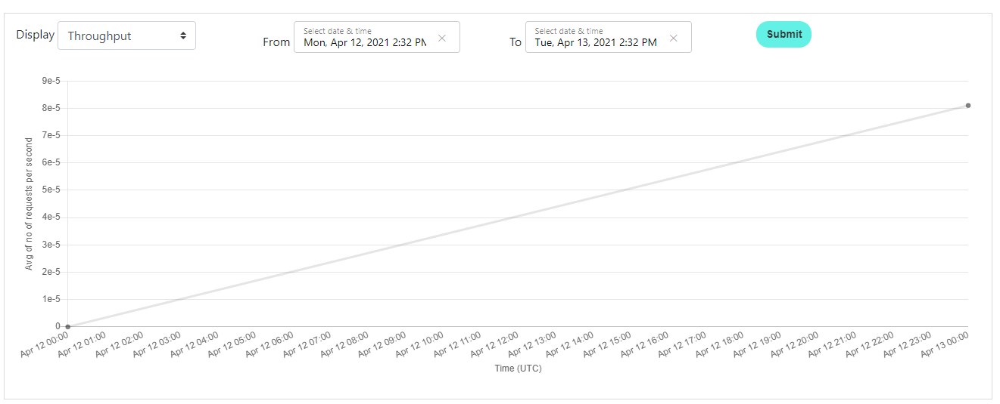

What is AWS Rekognition?
-------
**[AWS Rekognition](https://aws.amazon.com/rekognition/)** is a service that can be used to extract printed and handwritten text from images and documents with mixed languages and writing styles. In BELLATRIX, we use it to validate the layout of complex PDF documents. The service PAID after some usage each month. However, it is relatively cheaper than many other libraries and services or the cost of developing your own solution.
Usage
------------------
You can access the **AWS.Rekognition** service directly from the App class. Using the **ExtractOCRTextFromLocalFile** method, you can get a list of all text snippets in your document. You can use the **ValidateText** method to check whether a particular text sequence appears in your document under specific order.

```csharp
[Test]
public void MakeTextExtractionFromPDF()
{
    var textSnippets = App.AWS.Rekognition.ExtractOCRTextFromLocalFile(RegionEndpoint.EUCentral1, "pdfsS3Bucket", "sampleinvoice.pdf");
    textSnippets.ForEach(Console.WriteLine);

    List<string> expectedTextSnippets = new List<string>()
    {
        "69653 1st Point, 45 Acker Driv",
        "Subtotal",
        "$84.00",
        "Total",
        "$136.00",
    };

    App.AWS.Rekognition.ValidateText(RegionEndpoint.EUCentral1, "pdfsS3Bucket", "sampleinvoice.pdf", expectedTextSnippets);
}
```
You are not limited to PDFs only. You can use the same feature for extracting text from complex images. Similar to the one below.

You can use the following code snippet to verify the info.
```csharp
[Test]
public void ExtractTextFromGraph()
{
    var textSnippets = App.ComputerVision.ExtractOCRTextFromLocalFile(RegionEndpoint.EUCentral1, "imagesS3Bucket", "devPortalGraph1.PNG");
    textSnippets.ForEach(Console.WriteLine);

    List<string> expectedTextSnippets = new List<string>()
    {
        "Apr 12 01:00",
        "Apr 13 00:00",
    };

    App.ComputerVision.ValidateText(RegionEndpoint.EUCentral1, "imagesS3Bucket", "devPortalGraph1.PNG", expectedTextSnippets);
}
```