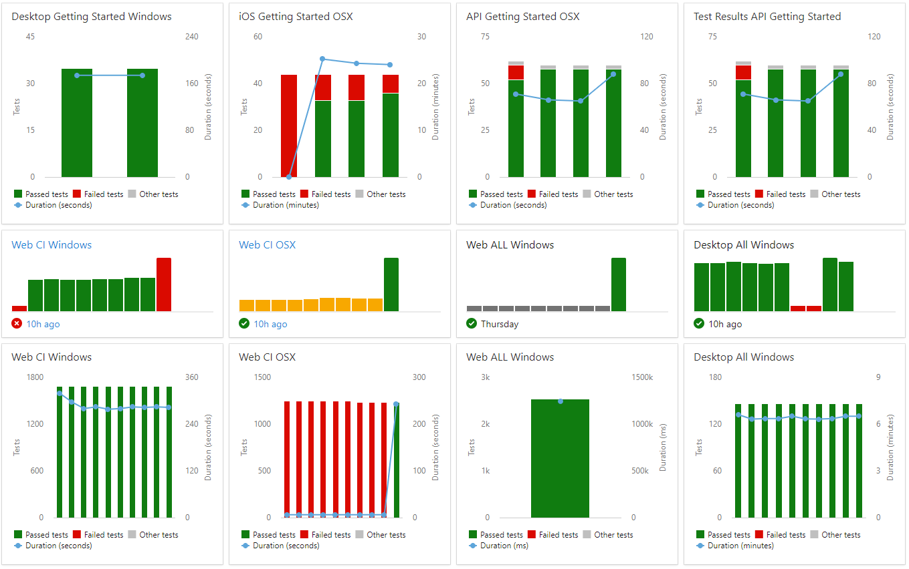
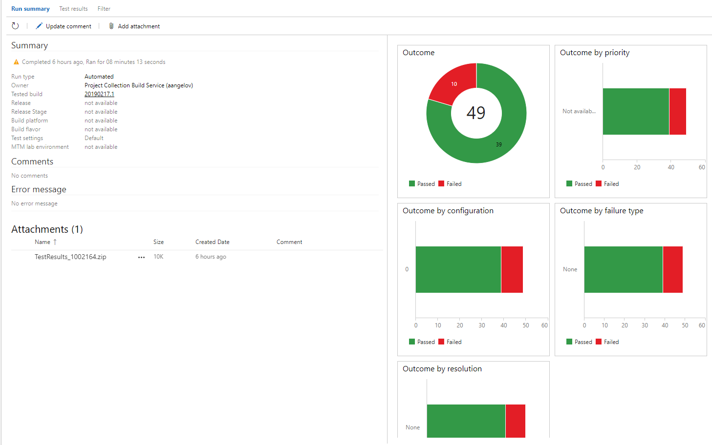
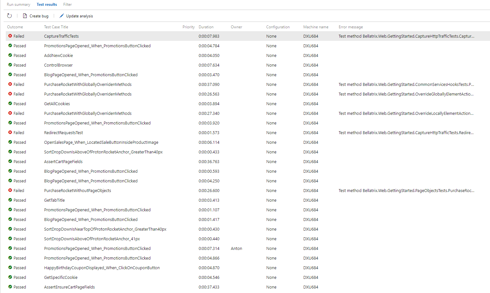
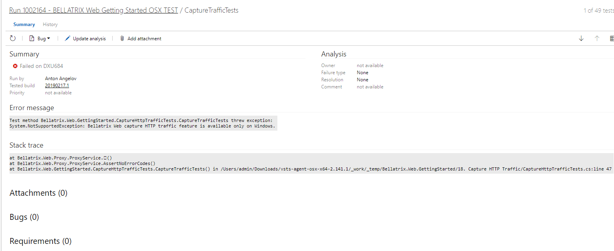

What Is Azure DevOps CI?
-------
[Azure DevOps](https://azure.microsoft.com/en-us/services/devops/) offers one of the best CI on the market. Instead of using 3rd party tools or systems you can directly publish the results in Azure DevOps.

You can create fully customizable dashboards to visualize the tests results and the latest status of your builds.

It offers a well designed interface for filtering and checking the latest published test results.

Also, you can see a summary with some informative charts.

If you open a failed tests, you can find detailed information why your tests failed. As part of BELLATRIX integration, your screenshots and video recordings will be uploaded, and you will be able to check them on this screen.

Configuration
-------------
If you want your screenshots and video recording of failed tests to be uploaded automatically to the Azure DevOps CI test reports, BELLATRIX offers such integration out of the box.