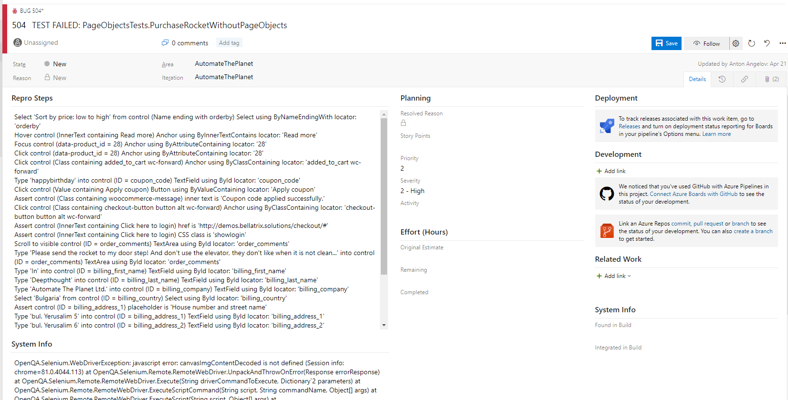
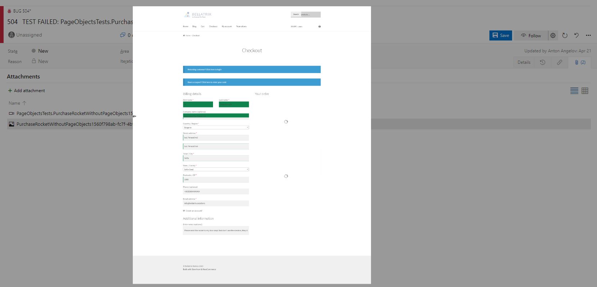

What Is Automatic Bug Reporting?
-------
The automatic bug reporting is a BELLATRIX feature that will create a bug automatically in various bug tracking software if some of your tests fail. The plugin will populate the description, attach a screenshot, video of the test. Moreover, it will generate human-readable steps to reproduce.





Configuration
-------------
First, you need to install the **Bellatrix.BugReporting.AzureDevOps** NuGet package to your tests project.
Next, you need to enable the Azure DevOps bug reporting BELLATRIX extension in your **TestInitialize** file.
```csharp
[TestClass]
public class TestsInitialize : WebTest
{
    [AssemblyInitialize]
    public static void AssemblyInitialize(TestContext testContext)
    {
        var app = new App();
        app.UseMsTestSettings();
        app.UseBrowserBehavior();
        app.UseLogExecutionBehavior();
        app.UseControlLocalOverridesCleanBehavior();
        app.UseFFmpegVideoRecorder();
        app.UseFullPageScreenshotsOnFail();
        app.UseLogger();
        app.UseElementsBddLogging();
        app.UseHighlightElements();
        app.UseEnsureExtensionsBddLogging();
        app.UseLayoutAssertionExtensionsBddLogging();
        app.UseExceptionAnalysation();
        app.Initialize();

        app.UseBugReporting();
        app.UseAssertExtensionsBugReporting();
        app.UseEnsureExtensionsBugReporting();
        app.UseLayoutAssertionExtensionsBugReporting();
        app.UseAzureDevOpsBugReporting();
    }

    [AssemblyCleanup]
    public static void AssemblyCleanup()
    {
        var app = ServicesCollection.Current.Resolve<App>();
        app?.Dispose();
    }
}
```
You need to add the following lines:
```csharp
app.UseBugReporting();
app.UseAssertExtensionsBugReporting();
app.UseEnsureExtensionsBugReporting();
app.UseLayoutAssertionExtensionsBugReporting();
app.UseAzureDevOpsBugReporting();
```
They will turn on the feature and will assign listeners to common actions in the framework that will populate the auto-generated test case's steps and expected results.
Next, you need to add a new section in the **testFrameworkSettings.json** settings file.
```
"bugReportingSettings": {
  "isEnabled": "true",
  "url": "https://dev.azure.com/yourCompanyName",
  "token": "autheticationToken",
  "organizationName": "yourOrganizationname",
  "projectName": "yourProjectName",
  "defaultPriority": "2",
  "defaultSeverity": "2 - High"
},
```
You can read the [the following article](https://docs.microsoft.com/en-us/azure/devops/organizations/accounts/use-personal-access-tokens-to-authenticate?view=azure-devops&tabs=preview-page "following article") how to generate an authentication token.

**NOTE**: Be sure to enable this feature only in Release and for test projects that contain stable tests because otherwise, it can create a lot of bugs based on your flaky tests.