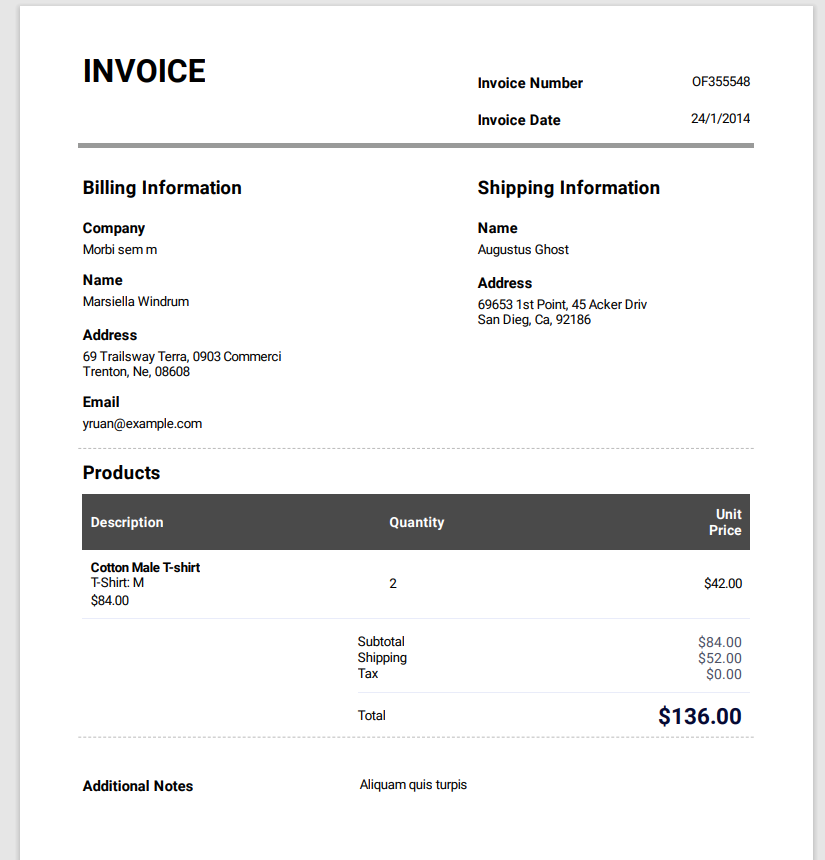
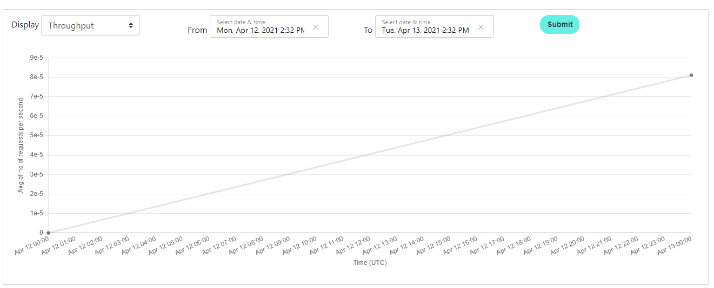
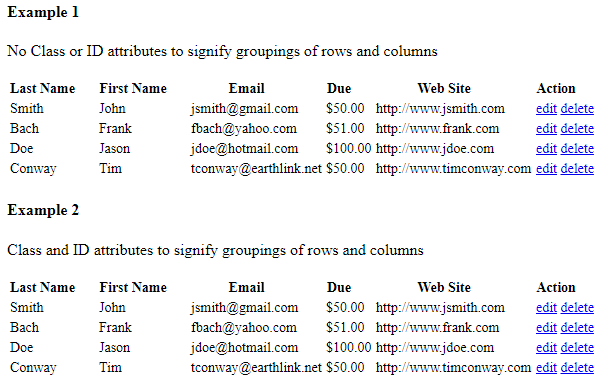

What is Azure Computer Vision?
-------
**[Azure Computer Vision](https://azure.microsoft.com/en-us/services/cognitive-services/computer-vision/)** is a service that can be used to extract printed and handwritten text from images and documents with mixed languages and writing styles. While **[Azure Form Recognizer](https://azure.microsoft.com/en-us/services/form-recognizer/)** is an AI-powered document extraction service that understands your document. In BELLATRIX, we use it to validate the layout of complex PDF documents. Both of these services are PAID after some usage each month. However, they are relatively cheaper than many other libraries and services or the cost of developing your own solution.


Configuration
------------------
To use the integrations you need first to create and configure the Computer Vision and Form Recognizer services in your Azure subscription. To do so, you can follow the [official documentation](https://docs.microsoft.com/en-us/azure/cognitive-services/computer-vision/quickstarts-sdk/image-analysis-client-library?tabs=visual-studio&pivots=programming-language-csharp).

Once you have everything in place you need to add the info to the BELLATRIX configuration under the **cognitiveServicesSettings** section.
```json
"cognitiveServicesSettings": {
  "computerVisionEndpoint": "computerVisionEndpointUrl",
  "computerVisionSubscriptionKey": "yourkey",
  "formRecognizerEndpoint": "formRecognizerEndpointUrl",
  "formRecognizerSubscriptionKey": "yourkey"
},
```

Usage
------------------
You can access the **ComputerVision** service directly from the App class. Using the **ExtractOCRTextFromLocalFile** method, you can get a list of all text snippets in your document. You can use the **ValidateText** method to check whether a particular text sequence appears in your document under specific order.

```csharp
[Test]
public void MakeTextExtractionFromPDF()
{
    var textSnippets = App.ComputerVision.ExtractOCRTextFromLocalFile("sampleinvoice.pdf");
    textSnippets.ForEach(Console.WriteLine);

    List<string> expectedTextSnippets = new List<string>()
    {
        "69653 1st Point, 45 Acker Driv",
        "Subtotal",
        "$84.00",
        "Total",
        "$136.00",
    };

    App.ComputerVision.ValidateText("sampleinvoice.pdf", "en", expectedTextSnippets);
}
```
You are not limited to PDFs only. You can use the same feature for extracting text from complex images. Similar to the one below.

You can use the following code snippet to verify the info.
```csharp
[Test]
public void ExtractTextFromGraph()
{
    var textSnippets = App.ComputerVision.ExtractOCRTextFromLocalFile("devPortalGraph1.PNG");
    textSnippets.ForEach(Console.WriteLine);

    List<string> expectedTextSnippets = new List<string>()
    {
        "Apr 12 01:00",
        "Apr 13 00:00",
    };

    App.ComputerVision.ValidateText("devPortalGraph1.PNG", "en", expectedTextSnippets);
}
```
Through the **ComputerVision** service, you can check whether the text is there. However, you cannot check whether it is in the right place. To enable this capability, you can use the **FormRecognizer** service. It supports much more advanced verifications. However, keep in mind that the **FormRecognizer** calls are a little bit more expensive since more computer power is needed for the analysis.
You can just compare the layout of two PDFs - one holding the expected layout.
```csharp
[Test]
public void AssertPdfLayoutBasedOnTemplate()
{
    App.FormRecognizer.SaveAnalyzedFileToJson("sampleinvoice.pdf", "analizedFileOutput.json");

    App.FormRecognizer.ValidateFormLayout("sampleinvoice.pdf", "sampleinvoice1.pdf");
}
```
The more advanced capabilities of our integration allows you treat the PDF as a table, asserting particular cells or rows, asserting words count or whether particular set of words are there.
```csharp
[Test]
public void AssertCellsText()
{
    var analyzedPdf = App.FormRecognizer.Analyze("sampleinvoice.pdf");
    analyzedPdf.AssertLinesCount(48);

    analyzedPdf.GetTable().GetCell(0, 3).AssertTextEquals("OF355548 24/1/2014");
    analyzedPdf.GetTable().GetCell(5, 1).AssertTextContains("45 Acker Driv");

    analyzedPdf.GetTable().GetCell(c => c.Text.StartsWith("69 Trailsway")).AssertTextContains("0903");

    analyzedPdf.Lines[46].AssertWordsCount(9);

    analyzedPdf.Lines[40].AssertWordsEqual("TERMS", "AND", "CONDITIONS");

    analyzedPdf.Lines[40].AssertWordsContain("TERMS", "CONDITIONS");
}
```
The feature is so well integrated into the framework that you can apply the same capabilities against HTML tables, grids, or even mobile and desktop components. Internally, the framework captures a screenshot of the specified element and then analyzes it through the Azure AI.

```csharp
[Test]
public void AssertTableComponentCellsText()
{
    App.Navigation.NavigateToLocalPage("TestPages\\Table\\table.html");

    var table = App.Components.CreateById<Table>("table1")
                                    .SetColumn("Last Name")
                                    .SetColumn("First Name")
                                    .SetColumn("Email")
                                    .SetColumn("Due")
                                    .SetColumn("Action");

    var analyzedTable = table.AIAnalyze();
    analyzedTable.AssertLinesCount(24);

    analyzedTable.Lines[13].AssertWordsCount(2);

    analyzedTable.Lines[23].AssertWordsContain("tconway", "delete", "edit");
}
```