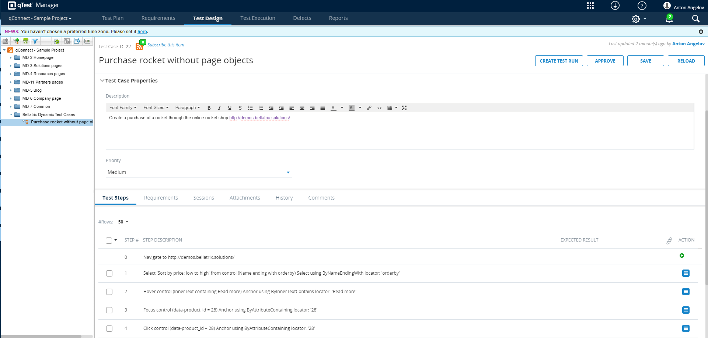

What Is a Dynamic Test Case?
-------
Dynamic test cases are a unique feature in BELLATRIX, where the framework automatically generates test cases in a popular test case management system based on your automated tests. It will populate the title, description, and other necessary properties automatically. Moreover, it will generate human-readable steps and expected results. The most significant benefit is that it will keep up to date your auto-generated test cases over time, no matter what you change in your tests.
It is an excellent functionality to allow non-technical people of your company to see what your tests are doing.



Configuration
-------------
First, you need to install the **Bellatrix.DynamicTestCases.QTest** NuGet package to your tests project.
Next, you need to enable the qTest dynamic test cases BELLATRIX extension in your **TestInitialize** file.
```csharp
[TestClass]
public class TestsInitialize : WebTest
{
    [AssemblyInitialize]
    public static void AssemblyInitialize(TestContext testContext)
    {
        QTestDynamicTestCasesPluginConfiguration.Add();
    }

    [AssemblyCleanup]
    public static void AssemblyCleanup()
    {
        var app = ServicesCollection.Current.Resolve<App>();
        app?.Dispose();
    }
}
```
You need to add the following lines:
```csharp
QTestDynamicTestCasesPluginConfiguration.Add();
```
They will turn on the feature and will assign listeners to common actions in the framework that will populate the auto-generated test case's steps and expected results.
Next, you need to add a new section in the **testFrameworkSettings.json** settings file.
```
  "dynamicTestCasesSettings": {
    "isEnabled": "true",
    "serviceAddress": "https://yourProject.qtestnet.com/",
    "token": "yourAuthenticationToken",
    "userName": "yourUserName",
    "password": "yourPass",
    "projectId": "559370",
    "fieldValues": [
      {
        "id": "9261",
        "value": "300",
        "displayValue": "Automation"
      },
      {
        "id": "8785",
        "value": "[1]",
        "displayValue": "[UI]"
      }
    ]
  },
```
You need to supply a user name and password or authentication token so that the plug-in API can connect with qTest. Also, if your test cases have custom fields, you can specify them under the fieldValues array.
The last step is to configure the test classes and tests.
```csharp
[TestClass]
[Browser(BrowserType.Chrome, Lifecycle.RestartEveryTime)]
[DynamicTestCase(SuiteId = "8260474")]
public class PageObjectsTests : WebTest
{
   [TestMethod]
   [DynamicTestCase(
        TestCaseId = "4d001440-bf6c-4a8b-b3e6-796cbad361e1", 
        Description = "Create a purchase of a rocket through the online rocket shop http://demos.bellatrix.solutions/")]
    public void PurchaseRocketWithPageObjects()
    {
		    App.TestCases.AddPrecondition($"Navigate to http://demos.bellatrix.solutions/");
        var homePage = App.GoTo<HomePage>();
        homePage.FilterProducts(ProductFilter.Popularity);
        homePage.AddProductById(28);
        homePage.ViewCartButton.Click();

        var cartPage = App.Create<CartPage>();
        cartPage.ApplyCoupon("happybirthday");
        cartPage.ProceedToCheckout.Click();

        var billingInfo = new BillingInfo
                                    {
                                        FirstName = "In",
                                        LastName = "Deepthought",
                                        Company = "Automate The Planet Ltd.",
                                        Country = "Bulgaria",
                                        Address1 = "bul. Yerusalim 5",
                                        Address2 = "bul. Yerusalim 6",
                                        City = "Sofia",
                                        State = "Sofia-Grad",
                                        Zip = "1000",
                                        Phone = "+00359894646464",
                                        Email = "info@bellatrix.solutions",
                                        ShouldCreateAccount = true,
                                        OrderCommentsTextArea = "cool product",
                                    };

        var checkoutPage = App.Create<CheckoutPage>();
        checkoutPage.FillBillingInfo(billingInfo);
        checkoutPage.CheckPaymentsRadioButton.Click();
    }
}
```
```csharp
[DynamicTestCase(SuiteId = "8260474")]
```
On top of your class you need to place the **DynamicTestCase** attribute and specify the suite id where the test cases part of this class to be generated.
```csharp
[DynamicTestCase(
        TestCaseId = "4d001440-bf6c-4a8b-b3e6-796cbad361e1", 
        Description = "Create a purchase of a rocket through the online rocket shop http://demos.bellatrix.solutions/")]
```
On top of your class, you need to place the **DynamicTestCase** attribute and specify the suite id where the test cases part of this class to be generated.
```csharp
App.TestCases.AddPrecondition($"Navigate to http://demos.bellatrix.solutions/");
```
Through **TestCases** property, you can add preconditions, custom steps, or expected results. You have access to it through the App service or directly in the BELLATRIX page objects.