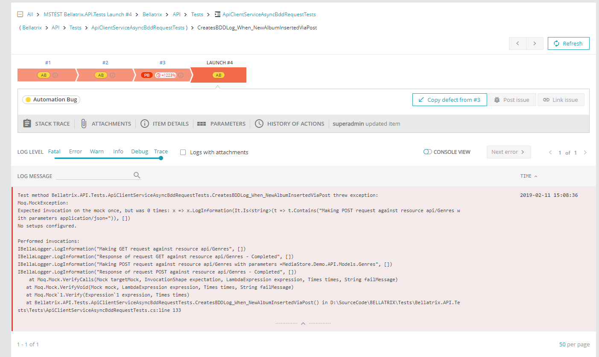

What is ReportPortal?
-------
**[ReportPortal](http://reportportal.io/)** is a service, that provides increased capabilities to speed up results analysis and reporting through the use of built-in analytic features. ReportPortal is a great addition to the Continuous Integration and Continuous Testing process.

The tool gives you the capability to create custom dashboards. I have created a dashboard visualizing the data from our latest BELLATRIX test runs. The first one shows the passing rate of all tests. The next one displays overall statistics- how many tests were executed and various types of bugs after the investigation process. Bellow, you can find some trend charts between runs. Also, there are some nice widgets for making a comparison between the test runs duration. 


There are widgets that display the latest runs flaky tests and the tests that most failed. It is a neat feature for stabilizing these tests.


In the Launches section, you can see the latest runs and filter them.


When you open a failed tests it initially is set that it needs investigation after that you can mark it as Product Bug, Automation Bug or System issue like a problem in the test environment.


All test failure info is synced automatically and well displayed.



You can filter based on the bug type and check all of these tests.


Installation
------------------
The easiest way to deploy ReportPortal it to use [Docker](https://docs.docker.com/). Docker allows to install ReportPortal on Linux, Mac or Windows. Make sure that you have allocated at least **2 CPUs** and **3GB RAM** for Docker operations.

1 Make sure the Docker ([Engine](https://docs.docker.com/engine/installation/), [Compose](https://docs.docker.com/compose/install/)) is installed.

2 Download the latest compose descriptor example from [here](https://github.com/reportportal/reportportal/blob/master/docker-compose.yml). You can make it by next command:

```
curl https://raw.githubusercontent.com/reportportal/reportportal/master/docker-compose.yml -o docker-compose.yml
```

3 Start the application using the following command:

```
docker-compose -p reportportal up -d --force-recreate
```

4 Open your browser with the IP address of the deployed environment at port 8080

```
http://127.0.0.1:8080
```

5 Use next login\pass for access:

**default\1q2w3e** or **superadmin\erebus**

[Official Documentation](http://reportportal.io/docs/Installation-steps)

Configuration
-------------
First, you need to install the **ReportPortal.VSTest.TestLogger** NuGet package to your tests project.
After that when you execute your tests through native **dotnet vstest** test runner the tests will be automatically synced with the portal. Next you need to a JSON configuration file to your project called **ReportPortal.config.json**.
```json
{
  "$schema": "https://raw.githubusercontent.com/reportportal/agent-net-vstest/master/ReportPortal.VSTest.TestLogger/ReportPortal.config.schema",
  "enabled": true,
  "server": {
    "url": "http://127.0.0.1:8080/api/v1/",
    "project": "superadmin_personal",
    "authentication": {
      "uuid": "d8685bb4-2f2a-4335-9c8b-1f2a5d176d02"
    }
  },
  "launch": {
    "name": "Automate The Planet Test Portal Demo",
    "description": "This is a demo run of the ATP demo examples for a demonstration of Test Portal integration with MSTest tests.",
    "debugMode": false,
    "tags": [ "Automate The Planet", "Test Reporting", "MSTEST" ]
  }
}
```
You need to mention the name of your project, and from the ReportPortal settings section, you need to copy the authentication guid for your user. In the launch settings, you can customize the name of the test runs and add some tags.

[Official Documentation](https://github.com/reportportal/agent-net-vstest)

If you run your tests from Visual Studio the results won't show up in the portal. Instead you need to run them from command line using the following command.

```
dotnet vstest Bellatrix.Web.Tests.dll --testcasefilter:TestCategory=CI --logger:ReportPortal
```

The most important part is mentioning the logger **--logger:ReportPortal**.

[dotnet vstest official documentation](https://docs.microsoft.com/en-us/dotnet/core/tools/dotnet-vstest?tabs=netcore21)

**NUnit Project Configuration**

First, you need to install the **ReportPortal.NUnit** NuGet package to your test project.

To enable NUnit extension you have to add **ReportPortal.addins** file in the folder where NUnit Runner is located. The content of the file should contain line with relative path to the ReportPortal.NUnitExtension.dll. To read more about how NUnit is locating extensions please follow [this](https://github.com/nunit/docs/wiki/Engine-Extensibility#locating-addins).

To enable **ReportPortal.Extension** you need create a **ReportPortal.addins** file in the **NUnitRunner** folder with the following content:

**../YourProject/bin/Debug/ReportPortal.NUnitExtension.dll**

[Official Documentation](https://github.com/reportportal/agent-net-nunit)