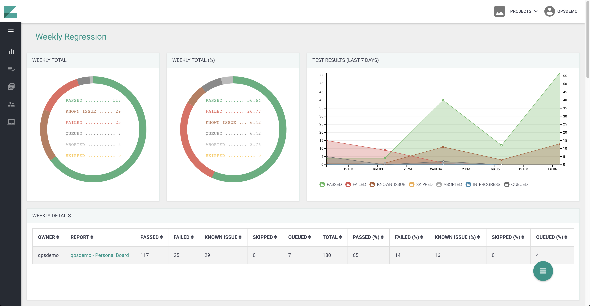
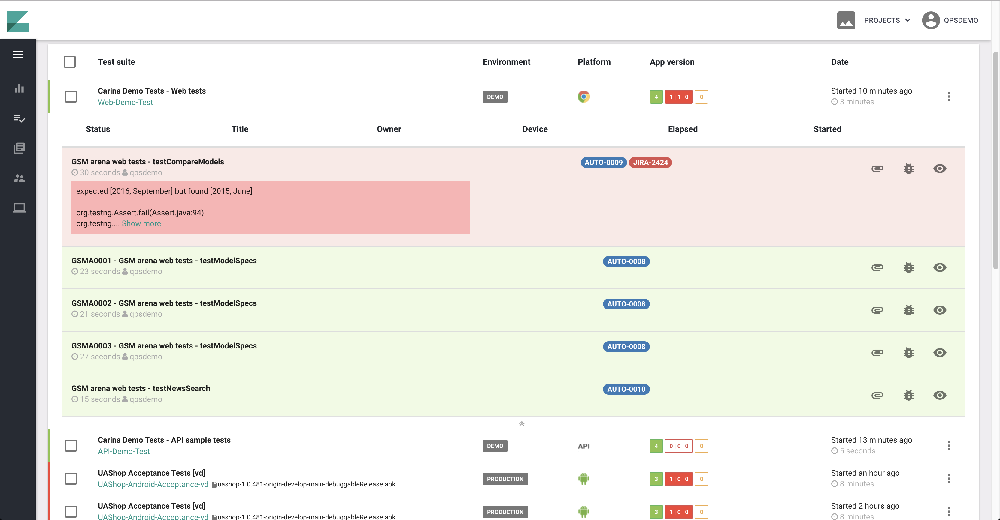
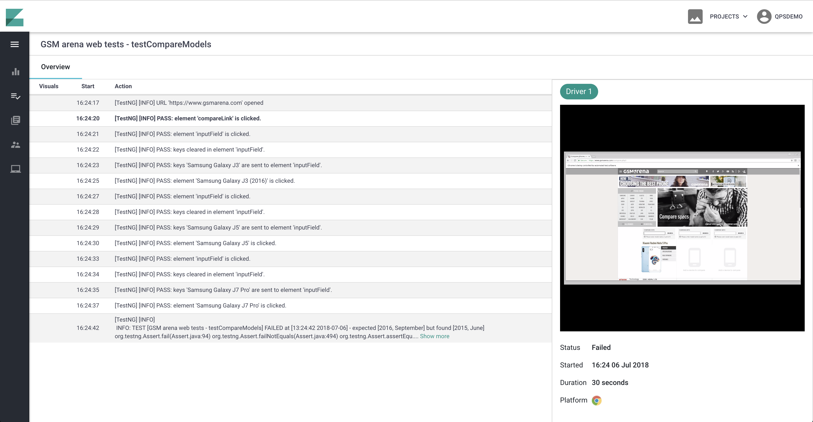
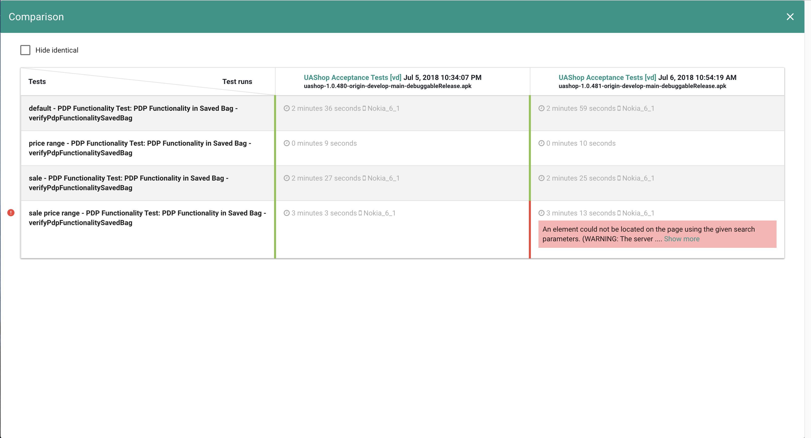
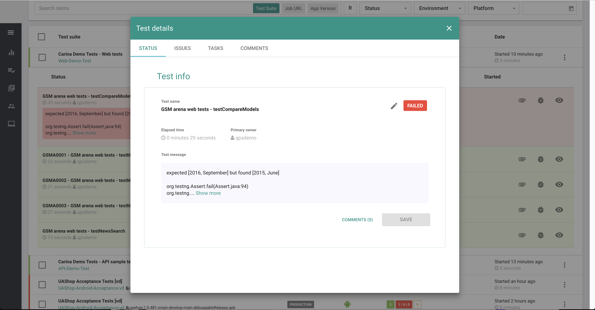

What is Zafira?
-------
**[Zafira](http://qaprosoft.github.io/zafira/)** is central automation reporting system that is built on the top of Java Spring Framework. It dramatically increases the transparency of test automation results and provides a better understanding of product quality. 
**Some of its primary features**
- Real-time test results tracking
- VNC streaming and video recording of test sessions
- Flexibly configured widgets and dashboards
- User management with authorization policies
- Integration with TestRail and JIRA
- Integration with Hipchat and Slack
- Ability to compose automation reports and send via email

You have a full control over the configuration of the main dashboard.



Tests results are displayed in real-time.



Zafira supports live streaming and video recording.



It includes powerful features for test runs comparison to easy the troubleshooting and tests results analyzation.



You can log bug to most popular bug tracking system directly from the tool.



Installation
------------------
The easiest way to deploy Zafira it to use Docker. Docker allows to install Zafira on Linux, Mac or Windows. Make sure that you have allocated at least **2 CPUs** and **4GB RAM** for Docker operations.

1 Clone Zafira repo
```
git clone git@github.com:qaprosoft/zafira.git
```

2 If you are planning to access Zafira remotely, you will need to modify docker-compose.yml specifying the appropriate IP address of your host

environment: 
```
- ZAFIRA_URL=http://localhost:8080
```

3 Start Zafira
```
$ docker-compose up -d
```

4 Verify deployment by running
```
$ docker ps
```

5 Open Zafira in your browser
```
http://localhost:8080/zafira
```

6 Use default credentials to login

**qpsdemo/qpsdemo**

Configuration
-------------
First, you need to install the **Bellatrix.Results.Zafira** NuGet package to your tests project.
Next, you need to enable the Allure BELLATRIX extension in your **TestInitialize** file.
```csharp
[TestClass]
public class TestsInitialize : WebTest
{
    [AssemblyInitialize]
    public static void AssemblyInitialize(TestContext testContext)
    {
        App.UseUnityContainer();
        App.UseMsTestSettings();
        App.UseBrowserBehavior();
        App.UseLogExecutionBehavior();
        App.UseControlLocalOverridesCleanBehavior();
        App.UseFFmpegVideoRecorder();
        App.UseFullPageScreenshotsOnFail();
        App.UseLogger();
        App.UseElementsBddLogging();
        App.UseHighlightElements();
        App.UseEnsureExtensionsBddLogging();
        App.UseLayoutAssertionExtensionsBddLogging();
        App.UseExceptionAnalysation();
        App.Initialize();
        App.UseZafira();
        App.AssemblyInitialize();
    }

    [AssemblyCleanup]
    public static void AssemblyCleanUp() => App.Dispose();
}
```
You need to add the **App.UseZafira();** line.
Next, you need to add two new sections to the **testFrameworkSettings.json** file.

```json
"zafira": {
    "enabled": "true",
    "accessToken": "eyJzdWIiOiIzIiwicGFzc3dvcmQiOiJBT3hNR01RU3RtbmJ5YTlZZzZ4UmMxdk9UY2FxQzRUYSIsInRlbmFudCI6ImJlbGxhdHJpeC",
    "projectName": "BELLATRIX",
    "firstName": "Anton",
    "lastName": "Angelov",
    "userId": "aangelov",
    "userEmail": "aangelov@automatetheplanet.com",
    "buildCause": "MANUAL",
    "testSuite": "Bellatrix.Web.Tests",
    "serviceUrl": "https://yourZafiuraServerUrl/zafira-ws",
    "parentUrl": "https://yourZafiuraServerUrl/zafira/job/unavailable/parent",
    "cIUrl": "https://yourZafiuraServerUrl/zafira/job/unavailable",
    "cIBuild": "15",
    "gitBranch": "TEST_IMPROVEMENTS",
    "gitCommit": "15",
    "reportEmails": "aangelov@automatetheplanet.com",
    "shouldSendReportEmails": "false"
  },
  "apiSettings": {
    "baseUrl": "https://yourZafiuraServerUrl/zafira-ws",
    "clientTimeoutSeconds": "30",
    "maxRetryAttempts": "3",
    "pauseBetweenFailures": "1",
    "timeUnit": "1"
  }
```
Once you have installed the portal, you need to generate an access token and set it to **accessToken** field.
To the **zafira** section you can configure various settings of the portal. Also, in the BELLATRIX-Zafira integration, we use **Bellatrix.API**, because of that you need to set few parameters in the **apiSettings** section.