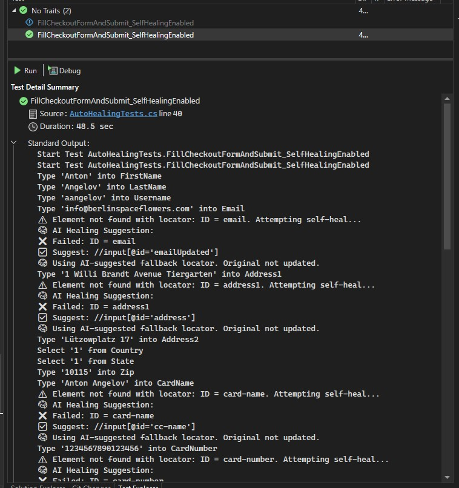
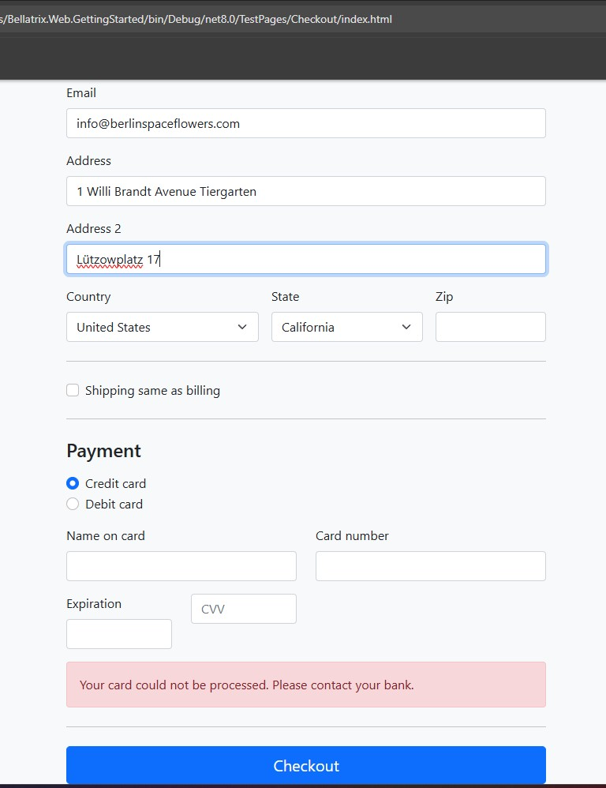
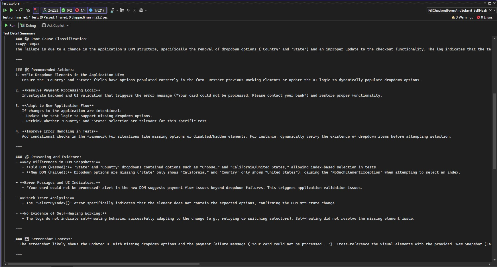

Overview
--------
BELLATRIX introduces four advanced AI-powered features for web automation using LLMs:

- **Element Finding by Prompt**: Locate elements using natural language instructions.
- **AssertByPrompt / ValidateByPrompt**: Perform assertions and validations using descriptive instructions.
- **Native Self-Healing via LLM**: Automatic healing of broken tests when the UI changes.
- **Smart AI Analysis**: Automated root cause analysis, evidence comparison, and failure diagnostics with BDD logging and page snapshots.

These capabilities drastically reduce test maintenance, increase test reliability, and enable true prompt-driven automation for any web application.

Element Finding by Prompt
--------
BELLATRIX allows you to locate web elements directly by describing them in natural language. This enables dynamic and resilient tests, without brittle hardcoded locators.

**Example Usage:**
```csharp
// Find by prompt – human-style instruction:
var addToCart = driver.FindElementByPrompt("find Add to cart anchor under 'Falcon 9' item");
addToCart.Click();

// Fallback to locator cache and self-healing
var checkbox = driver.FindElementByPrompt("find out of stock checkbox label under in stock, two elements are returned return the second one");
checkbox.Click();
```

**How it works:**
- The framework queries the vector database for known PageObject summaries and tries to map your prompt to a known locator.
- If no known locator is found, or if it fails, the system generates a new XPath using LLM, based on the current DOM summary.
- A cache mechanism stores successful prompt-locator pairs for faster and more robust future runs.

**Prompt-driven indexing of Page Objects**
If you enable `shouldIndexPageObjects` in the settings, all POMs are indexed in Qdrant for RAG-based mapping. This increases accuracy and speeds up element resolution.

```json
"largeLanguageModelsSettings": {
  //...
  "shouldIndexPageObjects": true,
  "pageObjectFilesPath": "40. Prompts Support\\Pages"
}
```

To trigger indexing, call:
```csharp
WebDriverAiExtensions.IndexAllPageObjects();
```
You should re-run indexing if you change or add new PageObjects.

AssertByPrompt and ValidateByPrompt
--------
Write human-readable assertions or validations describing expected UI state, using the page’s semantic summary.

**Example Usage:**
```csharp
// Using NUnit extension:
driver.AssertByPrompt("the 'Out Of Stock' checkbox is checked");

// Using Bellatrix ValidateByPrompt (fluent style):
ValidateByPrompt("validate that view cart button is visible");
ValidateByPrompt("validate that the total is 54 euro and the vat is 9 euro and -5 coupon applied and exactly 1 item added");
```

**Output:**
```
✅ AI Validate passed: validate that view cart button is visible
✅ AI Validate passed: validate that the total is 54 euro and the vat is 9 euro and -5 coupon applied and exactly 1 item added
```

**How it works:**
- BELLATRIX generates a prompt containing the full page summary in JSON and your natural language instruction.
- The LLM outputs "PASS" or "FAIL: [explanation]" for every validation or assertion.
- Failures are reported in your test output with reasoning.

Native Self-Healing via LLM
--------
When a locator fails (due to UI or DOM changes), BELLATRIX automatically:
1. Compares the last known working page snapshot with the current one.
2. Uses the LLM to generate a new XPath from the detected DOM differences.
3. Retries the action with the healed locator (the fallback is **not** saved permanently, only used for the current run).
4. Logs the attempted healing process and result.


**Trigger conditions:**  
- `enableSelfHealing` is set to `true` in `largeLanguageModelsSettings`.
- A locator throws due to element not found or changed attributes/structure.


**Typical scenarios:**
- IDs or attributes are renamed (e.g., `emailUpdated` → `email`).
- Elements are removed, moved, or have missing labels.
- Buttons/texts are changed (e.g., "Proceed to checkout" → "Checkout").


**Example test trigger:**  
See test: `FillCheckoutFormAndSubmit_SelfHealingEnabled` in `AutoHealingTests.cs`.

**

Smart AI Analysis via LLM
--------
On every failure (or optionally every run), BELLATRIX performs a comprehensive AI-driven analysis:

- **BDD-style logging**: Every test action and assertion is logged in detail.
- **Page snapshots**: Both successful and failing DOMs are stored and compared.
- **Screenshot support**: Full-page screenshots on failures.
- **Root cause classification**: The AI attempts to determine if the problem is a test bug, application bug, or environment issue.
- **Detailed recommendations**: Step-by-step actions for resolving detected issues.
- **Stack trace and visual context** are included for debugging.

**What Smart AI Analysis Provides:**
- Shows you the difference between previous passing and current failing DOM.
- Explains which element or locator failed, why, and what changed.
- Suggests both test and application fixes.

**
**

**Example output:**
```
🧠 AI-Driven Root Cause Summary:
---
### 🧠 Root Cause Classification:  
**App Bug**  
The failure is due to a change in the application’s DOM structure...
---
### 🛠 Recommended Actions:  
1. **Fix Dropdown Elements in the Application UI**
2. **Resolve Payment Processing Logic**
3. **Adapt to New Application Flow**
4. **Improve Error Handling in Tests**
---
### 🧩 Reasoning and Evidence:  
- **Key Differences in DOM Snapshots:**  
- **Error Messages and UI Indicators:**  
- **Stack Trace Analysis:**  
- **No Evidence of Self-Healing Working:**  
---
### 🖼️ Screenshot Context:
  The screenshot likely shows the updated UI with missing dropdown options and the payment failure message.
```

Configuration and Settings
--------
All main AI features are controlled in **`testFrameworkSettings.Debug.json`** under the section **`largeLanguageModelsSettings`**.

**Sample settings:**
```json
"largeLanguageModelsSettings": {
  "modelSettings": [
    {
      "endpoint": "env_AZURE_OPENAI_ENDPOINT",
      "key": "env_AZURE_OPENAI_KEY",
      "deployment": "gpt-4o"
    },
    {
      "serviceId": "openai-embed",
      "endpoint": "env_AZURE_OPENAI_EMBEDDINGS_ENDPOINT",
      "key": "env_AZURE_OPENAI_EMBEDDINGS_KEY",
      "embeddingDeployment": "text-embedding-ada-002"
    }
  ],
  "qdrantMemoryDbEndpoint": "http://localhost:6333",
  "localCacheConnectionString": "env_LocalCacheConnectionString",
  "localCacheProjectName": "web_getting_started",
  "shouldIndexPageObjects": false,
  "pageObjectFilesPath": "40. Prompts Support\Pages",
  "memoryIndex": "PageObjects",
  "resetIndexEverytime": false,
  "locatorRetryAttempts": 5,
  "validationsTimeout": 15,
  "sleepInterval": 1,
  "enableSelfHealing": true,
  "enableSmartFailureAnalysis": true
}
```

**Where to set up:**  
- The configuration file is found in **Bellatrix.LLM** project’s root folder.
- If you run in Docker, set your model endpoints and keys as environmental variables.

**Initial Docker Compose for Local Qdrant and PostgreSQL cache:**
```bash
docker-compose -f docker-compose.local_cache_postgres.yml up -d
```

- You can find the compose file in the root folder of the **Bellatrix.LLM** project.
- In the cloud, deploy your own Qdrant instance and set the connection string and endpoint in your config/environment variables.
- Environmental variables required:  
  - `AZURE_OPENAI_ENDPOINT`  
  - `AZURE_OPENAI_KEY`  
  - `AZURE_OPENAI_EMBEDDINGS_ENDPOINT`  
  - `AZURE_OPENAI_EMBEDDINGS_KEY`  
  - `LocalCacheConnectionString`

**DB Caching Mechanism:**  
- Successfully resolved locators for prompts are stored locally in the cache.
- This allows re-use and "self-healing" between runs – no repeated AI calls for the same instruction if the locator didn’t change.
- The cache is resettable per project via `localCacheProjectName`.

Troubleshooting & Examples
--------
- If a test heals itself, you will see log entries such as:
  - `⚠️ RAG-located element not present. Trying cached selectors...`
  - `🧠 Caching new selector for 'find 'Saturn V' quantity number input': //input[@id='quantity_6836c067a6729']`
  - `✅ Using cached selector.`

- If healing fails, smart AI analysis explains exactly why, and what to do next.
- You can use the provided standard output and AI analysis blocks as templates for what to expect.

Shadow DOM Support
--------
BELLATRIX fully supports Shadow DOM automation, including:
- Locating elements in nested shadow roots by prompt, XPath, or CSS.
- AI-based smart failure analysis and healing inside Shadow DOM elements.
- The prompt-driven locator logic works seamlessly inside and outside shadow trees.

**How it works:**  
- Shadow DOM roots and element structure are parsed and included in the JSON DOM summary.
- You can use `FindElementByPrompt` to locate any element, even in deeply nested Shadow DOM scenarios.

Refer to [shadow-dom.md](/web-automation/shadow-dom/) for deep technical details.