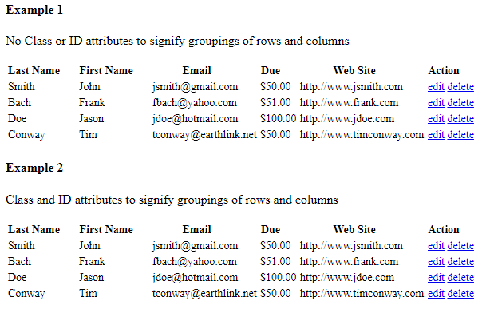
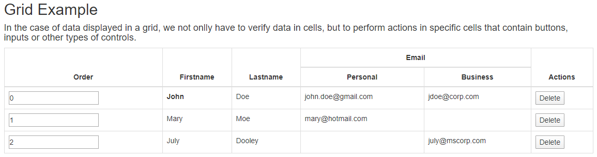

Introduction
-------
The difference between a table and grid is that usually, the grids are more complex than a regular HTML table. In them, you can have dynamic data. Moreover, inside the column, you can have other HTML elements such as buttons, text fields, selects, other tables. Or you can filter, sort the columns, and have paging for the grid. Instead of getting specific cells or rows by custom locators- we have created the Table and Grid controls, which ease the selection of cells/rows and assertion of the data. Moreover, in many cases there isn't a unique item which you can use to select the row/cell.

Tables
-------

## Example ##
```csharp
[TestClass]
[Browser(BrowserType.Chrome, Lifecycle.ReuseIfStarted)]
public class TableControlTests : WebTest
{
    private List<User> _expectedUsers;
    private static Table Table => App.ElementCreateService.CreateById<Table>("table1")
        .SetColumn("Last Name")
        .SetColumn("First Name")
        .SetColumn("Email")
        .SetColumn("Due")
        ////.SetColumn("Web Site") // this property won't be asserted if you use the AssertTable method.
        .SetColumn("Action");

    public override void TestInit()
    {
        App.NavigationService.NavigateToLocalPage("TestPages\\Table\\table.html");

        _expectedUsers = new List<User>
        {
            new User
            {
                FirstName = "John",
                LastName = "Smith",
                Email = "jsmith@gmail.com",
                WebSite = "http://www.jsmith.com",
                Due = "$50.00",
            },
            new User
            {
                FirstName = "Frank",
                LastName = "Bach",
                Email = "fbach@yahoo.com",
                WebSite = "http://www.frank.com",
                Due = "$51.00",
            },
            new User
            {
                FirstName = "Jason",
                LastName = "Doe",
                Email = "jdoe@hotmail.com",
                WebSite = "http://www.jdoe.com",
                Due = "$100.00",
            },
            new User
            {
                FirstName = "Tim",
                LastName = "Conway",
                Email = "tconway@earthlink.net",
                WebSite = "http://www.timconway.com",
                Due = "$50.00",
            },
        };
    }

    [TestMethod]
    public void AssertMiscData()
    {
        Assert.AreEqual(_expectedUsers[0].Email, Table.GetItems<User>()[0].Email);

        Table.AssertTable(_expectedUsers);

        Assert.AreEqual("Action", Table.GetHeaderNames().Last());
    }

    [TestMethod]
    [Browser(BrowserType.Edge, Lifecycle.ReuseIfStarted)]
    public void AssertCells()
    {
        Table.ForEachCell(cell => Assert.AreEqual("14px", cell.GetCssValue("font-size")));
        Table.GetCell("First Name", 1).ValidateInnerTextIs("Frank");
        Table.GetCell(1, 2).ValidateInnerTextIs("Jason");
        Table.GetCell<User>(cell => cell.Email, 1).ValidateInnerTextIs("fbach@yahoo.com");
        ElementsList<TableCell> cells = Table.GetCells(cell => cell.InnerText.ToLower().StartsWith('j'));
        Assert.AreEqual(4, cells.Count());
        var matchingCell = Table.GetFirstOrDefaultCell(cell => cell.InnerText.ToLower().StartsWith('j'));
        matchingCell.ValidateInnerTextIs("John");
    }

    [TestMethod]
    [Browser(BrowserType.Firefox, Lifecycle.ReuseIfStarted)]
    public void AssertSpecificRow()
    {
        var firstRow = Table.GetRow(0);
        Assert.AreEqual(0, firstRow.Index);
        Assert.IsTrue(firstRow.InnerHtml.Contains("</td>"));
        firstRow.ValidateInnerHtmlContains("</td>");
        var firstCell = Table.GetRow(0).GetCell(0);
        firstCell.ValidateInnerTextIs("Smith");
        var secondCell = firstRow.GetCell("Email");
        secondCell.ValidateInnerTextIs("jsmith@gmail.com");
        IEnumerable<TableCell> cells = firstRow.GetCells();
        Assert.AreEqual(6, cells.Count());
        ElementsList<TableCell> matchingCells = firstRow.GetCells(cell => cell.InnerText.ToLower().Contains("smith"));
        Assert.AreEqual(3, matchingCells.Count());
        var matchingCell = firstRow.GetFirstOrDefaultCell(cell => cell.InnerText.ToLower().Contains("smith"));
        matchingCell.ValidateInnerTextIs("Smith");
        Assert.AreEqual("jsmith@gmail.com", firstRow.GetItem<User>().Email);
        firstRow.AssertRow(_expectedUsers[0]);
    }

    [TestMethod]
    public void AssertHeaders()
    {
        Table.TableHeaderRows.ForEach(header => header.AssertFontFamily("\"Times New Roman\""));
        Table.ForEachHeader(row => row.AssertFontFamily("\"Times New Roman\""));
        ElementsList<Label> headerCells = Table.ColumnHeaders;
        headerCells.ForEach(cell => cell.AssertFontSize("16px"));
    }

    [TestMethod]
    public void AssertSpecificCell()
    {
        var firstCell = Table.GetCell(0, 0);
        Assert.AreEqual(0, firstCell.Row);
        Assert.AreEqual(0, firstCell.Column);
        Assert.AreEqual("Smith", firstCell.InnerText);
        firstCell.ValidateInnerTextIs("Smith");
        var thirdCell = Table.GetCell(0, 2);
        Assert.AreEqual("Doe", thirdCell.InnerHtml);
        thirdCell.ValidateInnerHtmlIs("Doe");
    }

    [TestMethod]
    public void AssertColumns()
    {
        var secondColumn = Table.GetColumn(1);
        Assert.AreEqual("John", secondColumn[0].InnerText);
        secondColumn[0].ValidateInnerTextIs("John");
        secondColumn = Table.GetColumn("First Name");
        Assert.AreEqual("John", secondColumn[0].InnerText);
        secondColumn[0].ValidateInnerTextIs("John");
    }
}
```
## Explanations ##
```csharp
private static Table Table => App.ElementCreateService.CreateById<Table>("table1")
    .SetColumn("Last Name")
    .SetColumn("First Name")
    .SetColumn("Email")
    .SetColumn("Due")
    ////.SetColumn("Web Site")
    .SetColumn("Action");
```
BELLATRIX gives you API for easing the work with HTML tables. Through the **SetColumn** you map the headers of the table if for some reason you don't want some column, just don't add it. The method returns a list of all rows' data as C# data mapped to the map you provided. Since we haven't the **SetColumn** for the WebSite- this property won't be asserted if you use the **AssertTable** method.
### General Methods ###
```csharp
Assert.AreEqual(_expectedUsers[0].Email, Table.GetItems<User>()[0].Email);
```
You can get all rows as instances of a specific class through the GetItems method.
```csharp
Table.AssertTable(_expectedUsers);
```
Compares all table rows to the expected entities. Each row is internally converted to the type of the expected entities.
```csharp
Assert.AreEqual("Action", Table.GetHeaderNames().Last());
```
### Cells' Related Methods ###
You can get all header names. Doubled headers are returned as one entry and separated by space.
```csharp
Table.ForEachCell(cell => Assert.AreEqual("14px", cell.GetCssValue("font-size")));
```
As a shortcut, you can iterate over all table cells through the **ForEachCell** method.
```csharp
Table.ForEachCell(cell => Assert.AreEqual("14px", cell.GetCssValue("font-size")));
```
You can get a particular cell as BELLATRIX element mentioning the column header and row number.
```csharp
Table.GetCell(1, 2).ValidateInnerTextIs("Jason");
```
You can get a particular cell as BELLATRIX element mentioning the row and column number.
```csharp
Table.GetCell<User>(cell => cell.Email, 1).ValidateInnerTextIs("fbach@yahoo.com");
```
You can get a particular cell by header expression and row number.
```csharp
ElementsList<TableCell> cells = Table.GetCells(cell => cell.InnerText.ToLower().StartsWith('j'));
Assert.AreEqual(4, cells.Count());
```
You can get particular cells by a selector.
```csharp
var matchingCell = Table.GetFirstOrDefaultCell(cell => cell.InnerText.ToLower().StartsWith('j'));
matchingCell.ValidateInnerTextIs("John");
```
As a shortcut, you can get the first cell matching a given condition through the **GetFirstOrDefaultCell** method.
```csharp
Assert.AreEqual(0, firstCell.Row);
Assert.AreEqual(0, firstCell.Column);
```
You can get the cell row and column.
```csharp
Assert.AreEqual("Smith", firstCell.InnerText);
```
You can get the cell innerText.
```csharp
firstCell.ValidateInnerTextIs("Smith");
```
You can use built-in BELLATRIX ensure methods to assert the cell attributes.
```csharp
var thirdCell = Table.GetCell(0, 2);
Assert.AreEqual("Doe", thirdCell.InnerHtml);
```
You can get the cell by row and column index.

### Rows' Related Methods ###
```csharp
var firstRow = Table.GetRow(0);
```
You can get a specific row using the **GetRow** method by the index of the row.
```csharp
Assert.AreEqual(0, firstRow.Index);
```
You can get the index of a given row through the **Index** property.
```csharp
Assert.IsTrue(firstRow.InnerHtml.Contains("</td>"));
```
You can get the HTML through the **InnerHtml** property.
```csharp
firstRow.ValidateInnerHtmlContains("</td>");
```
If you only need to assert the inner HTML you can use the built-in BELLATRIX ensure methods.
```csharp
var firstCell = Table.GetRow(0).GetCell(0);
```
There are many ways to get a specific cell through the indexer and the **GetCell** methods.
```csharp
var secondCell = firstRow.GetCell("Email");
secondCell.ValidateInnerTextIs("jsmith@gmail.com");
```
You can get a cell by header name.
```csharp
IEnumerable<TableCell> cells = firstRow.GetCells();
Assert.AreEqual(6, cells.Count());
```
You can get all row cells through the **GetCells** method.
```csharp
ElementsList<TableCell> matchingCells = firstRow.GetCells(cell => cell.InnerText.ToLower().Contains("smith"));
Assert.AreEqual(3, matchingCells.Count());
```
You can get the cells matching a condition.
```csharp
var matchingCell = firstRow.GetFirstOrDefaultCell(cell => cell.InnerText.ToLower().Contains("smith"));
matchingCell.ValidateInnerTextIs("Smith");
```
You can get the first cell matching a condition through the **GetFirstOrDefaultCell** method.
```csharp
Assert.AreEqual("jsmith@gmail.com", firstRow.GetItem<User>().Email);
```
You can convert a row to an instance of a specific class through the **GetItem** method.
```csharp
firstRow.AssertRow(_expectedUsers[0]);
```
You can compare a row to an instance of a specific class. The row is internally converted to the type of the expected object.
### Headers' Related Methods ###
```csharp
var secondColumn = Table.GetColumn(1);
Assert.AreEqual("John", secondColumn[0].InnerText);
```
You can get the cells of a particular column mentioning the column number.
```csharp
secondColumn[0].ValidateInnerTextIs("John");
```
You can use built-in BELLATRIX ensure methods to assert the cell attributes.
```csharp
secondColumn = Table.GetColumn("First Name");
Assert.AreEqual("John", secondColumn[0].InnerText);
```
You can get the cells of a particular column mentioning the column name.
### Data Objects ###
```csharp
public class User
{
    [HeaderName("Last Name")]
    public string LastName { get; set; }
    [HeaderName("First Name")]
    public string FirstName { get; set; }
    public string Email { get; set; }
    public string Due { get; set; }
    [HeaderName("Web Site")]
    public string WebSite { get; set; }
}
```
In order **GetItems** to be able to work you need to map the properties to headers through the **HeaderName** attribute this is how we handle differences between the property name, spaces in the headers and such.

Grids
-------
The difference between a table and grid is that usually, the grids are more complex than a regular HTML table. In them, you can have dynamic data. Moreover, inside the column, you can have other HTML elements such as buttons, text fields, selects, other tables. Or you can filter, sort the columns, and have paging for the grid. Instead of getting specific cells or rows by custom locators-we have created the Table and Grid controls, which ease the selection of cells/rows and assertion of the data. Moreover, in many cases there isn't a unique item which you can use to select the row/cell.

## Example ##
```csharp
[TestClass]
[Browser(BrowserType.Chrome, BrowserBehavior.ReuseIfStarted)]
public class GridControlTests : WebTest
{
    private static List<Employee> _expectedItems;
    public Grid TestGrid => App.ElementCreateService.CreateById<Grid>("sampleGrid")
        .SetColumn("Order", typeof(TextField), Find.By.Tag("input"))
        .SetColumn("Firstname")
        .SetColumn("Lastname")
        .SetColumn("Email Personal")
        .SetColumn("Email Business")
        .SetColumn("Actions", typeof(Button), Find.By.Xpath("./input[@type='button']"));

    public override void TestInit()
    {
        App.NavigationService.NavigateToLocalPage("TestPages\\Grid\\Grid.html");

        _expectedItems = new List<Employee>
        {
            new Employee
            {
                Order = "0",
                FirstName = "John",
                LastName = "Doe",
                PersonalEmail = "john.doe@gmail.com",
                BusinessEmail = "jdoe@corp.com",
            },
            new Employee
            {
                Order = "1",
                FirstName = "Mary",
                LastName = "Moe",
                BusinessEmail = string.Empty,
                PersonalEmail = "mary@hotmail.com",
            },
            new Employee
            {
                Order = "2",
                FirstName = "July",
                LastName = "Dooley",
                BusinessEmail = "july@mscorp.com",
                PersonalEmail = string.Empty,
            },
        };
    }

    [TestMethod]
    public void AssertGridCells()
    {
        TestGrid.ForEachCell(cell => cell.AssertFontSize("14px"));
        TestGrid.GetCell("Firstname", 1).ValidateInnerTextIs("Mary");
        TestGrid.GetCell(0, 1).ValidateInnerTextIs("John");
        TestGrid.GetCell<Employee>(cell => cell.PersonalEmail, 1).ValidateInnerTextIs("mary@hotmail.com");
        ElementsList<TableCell> matchingCells = TestGrid.GetCells<TableCell>(cell => cell.InnerText.StartsWith('J'));
        Assert.AreEqual(2, matchingCells.Count());
        TestGrid.GetCell("Email Business", 0).ValidateInnerTextIs("jdoe@corp.com");
        var firstRowEmail = TestGrid.GetRow(0).GetCell("Email Personal");
        TestGrid.GetCell("Actions", 0).As<Button>().Click();
        var firstRowEmailAfterDelete = TestGrid.GetRow(0).GetCell("Email Personal");
        Assert.AreNotEqual(firstRowEmail, firstRowEmailAfterDelete);
    }

    [TestMethod]
    public void AssertObjectsData()
    {
        var expectedObj = _expectedItems[0];
        var actualObj = TestGrid.GetItems<Employee>()[0];
        EntitiesAsserter.AreEqual(expectedObj, actualObj);
        TestGrid.GetRow(0).AssertRow(expectedObj);
        TestGrid.AssertTable(_expectedItems);
        Assert.AreEqual("Email Personal", TestGrid.GetHeaderNames().FirstOrDefault(header => header.StartsWith("Email")));
    }

    [TestMethod]
    public void AssertHeaders()
    {
        TestGrid.TableHeaderRows.ForEach(header => header.AssertFontFamily("\"Helvetica Neue\", Helvetica, Arial, sans-serif"));
        TestGrid.ForEachHeader(row => row.AssertFontFamily("\"Helvetica Neue\", Helvetica, Arial, sans-serif"));
        var headerCells = TestGrid.ColumnHeaders.Where(cell => !string.IsNullOrEmpty(cell.InnerText)).ToElementList();
        headerCells.ForEach(cell => cell.AssertFontSize("14px"));
    }

    [TestMethod]
    public void AssertRows()
    {
        Assert.AreEqual(3, TestGrid.GetRows().Count());
        TestGrid.ForEachRow(row => row.CreateByXpath<Button>(".//input[@type='button']").ValidateIsVisible());
        var secondRow = TestGrid.GetRow(1);
        Assert.AreEqual(1, secondRow.GetCells<TableCell>(cell => cell.InnerText == "Mary").Count());
        var firstRow = TestGrid.GetRow(0);
        firstRow = TestGrid.GetRows<TableCell>(cell => cell.InnerText.Contains("J")).First();
        firstRow = TestGrid.GetFirstOrDefaultRow<TableCell>(cell => cell.InnerText.Contains("J"));
    }

    [TestMethod]
    public void AssertSpecificRow()
    {
        var firstRow = TestGrid.GetRow(0);
        Assert.AreEqual(0, firstRow.Index);
        Assert.IsTrue(firstRow.InnerHtml.Contains("</td>"));
        firstRow.ValidateInnerHtmlContains("</td>");
        var firstCell = firstRow.GetCell("Order");
        firstCell.As<TextField>().ValidateValueIs("0");
        var secondCell = firstRow[1];
        secondCell = firstRow.GetCell(1);
        secondCell.ValidateInnerTextIs("John");
        IEnumerable<GridCell> cells = firstRow.GetCells();
        Assert.AreEqual(6, cells.Count());
        ElementsList<TableCell> textFields = firstRow.GetCells<TableCell>(cell => cell.InnerText.StartsWith("John") || cell.InnerText.StartsWith("john"));
        Assert.AreEqual(2, textFields.Count());
        var firstInputCell = firstRow.GetFirstOrDefaultCell<TextField>(cell => cell.TagName == "input");
        firstInputCell.ValidateValueIs("0");
        Assert.AreEqual("John Doe", $"{firstRow.GetItem<Employee>().FirstName} {firstRow.GetItem<Employee>().LastName}");
        firstRow.AssertRow(_expectedItems[0]);
    }

    [TestMethod]
    public void AssertSpecificCell()
    {
        var secondCell = TestGrid.GetCell(0, 1);
        Assert.AreEqual(0, secondCell.Row);
        Assert.AreEqual(1, secondCell.Column);
        Assert.AreEqual("John", secondCell.InnerText);
        Assert.AreEqual("<b>John</b>", secondCell.InnerHtml);
        var firstCell = TestGrid.GetCell(0, 0);
        firstCell.As<TextField>().ValidateValueIs("0");
        Assert.AreEqual("0", firstCell.As().Value);
    }

    [TestMethod]
    public void AssertColumns()
    {
        var firstColumn = TestGrid.GetColumn(0);
        firstColumn[0].As<TextField>().ValidateValueIs("0");
        firstColumn = TestGrid.GetColumn("Order");
        firstColumn[0].As<TextField>().ValidateValueIs("0");
        Assert.AreEqual("Email Personal", TestGrid.GetGridColumnNameByIndex(3));
    }
}
```

## Explanations ##
```csharp
public Grid TestGrid => App.ElementCreateService.CreateById<Grid>("sampleGrid")
    .SetColumn("Order", typeof(TextField), Find.By.Tag("input"))
    .SetColumn("Firstname")
    .SetColumn("Lastname")
    .SetColumn("Email Personal")
    .SetColumn("Email Business")
    .SetColumn("Actions", typeof(Button), Find.By.Xpath("./input[@type='button']"));
```
BELLATRIX gives you API for easing the work with HTML grids. Through the **SetColumn** you map the headers of the table if for some reason you don't want some column, just don't add it. The method returns a list of all rows' data as C# data mapped to the map you provided. Since we haven't the **SetColumn** for the WebSite- this property won't be asserted if you use the **AssertTable** method. You can get the cell converted to the element specified by the grid **SetColumn** method. Also, since some of this simple controls sometimes are wrapped inside DIV or SPAN elements, you can specify additional locator for finding the element.
### General Methods ###
```csharp
var expectedObj = _expectedItems[0];
var actualObj = TestGrid.GetItems<Employee>()[0];
```
You can get all rows as instances of a specific class through the **GetItems** method.
```csharp
TestGrid.GetRow(0).AssertRow(expectedObj);
```
Instead of first casting the items and then to get them by index and then assert them manually. You can get specific row through **GetRow** method and use the built-in **AssertRow** method to verify the row's data.
```csharp
TestGrid.AssertTable(_expectedItems);
```
Compares all grid rows to the expected entities. Each row is internally converted to the type of the expected entities.
```csharp
Assert.AreEqual("Email Personal", TestGrid.GetHeaderNames().FirstOrDefault(header => header.StartsWith("Email")));
```
You can get all header names. Doubled headers are returned as one entry and separated by space.

### Cells' Related Methods ###
```csharp
Assert.AreEqual(0, secondCell.Row);
Assert.AreEqual(1, secondCell.Column);
```
You can get the cell row and column.
```csharp
Assert.AreEqual("John", secondCell.InnerText);
```
You can get the cell inner text.
```csharp
Assert.AreEqual("<b>John</b>", secondCell.InnerHtml);
```
You can get the cell inner HTML.
```csharp
var firstCell = TestGrid.GetCell(0, 0);
firstCell.As<TextField>().ValidateValueIs("0");
```
You can get the cell converted to a specific element and use the element's specific API.
```csharp
Assert.AreEqual("0", firstCell.As().Value);
```
You can get the cell converted to the element specified by the grid **SetColumn** method.

### Rows' Related Methods ###
```csharp
Assert.AreEqual(3, TestGrid.GetRows().Count());
```
You can get the grid rows (without the header ones) through the **GetRows** method.
```csharp
TestGrid.ForEachRow(row => row.CreateByXpath<Button>(".//input[@type='button']").ValidateIsVisible());
```
As a shortcut, you can iterate over the grid rows through the **ForEachRow** method.
```csharp
var secondRow = TestGrid.GetRow(1);
Assert.AreEqual(1, secondRow.GetCells<TableCell>(cell => cell.InnerText == "Mary").Count());
```
You can get a specific row by its index through the **GetRow** method.
```csharp
var firstRow = TestGrid.GetRow(0);
firstRow = TestGrid.GetRows<TableCell>(cell => cell.InnerText.Contains("J")).First();
```
You can get all rows matching a given condition through the **GetRows** method.
```csharp
firstRow = TestGrid.GetFirstOrDefaultRow<TableCell>(cell => cell.InnerText.Contains("J"));
```
As a shortcut, you can get the first row matching a given condition through the **GetFirstOrDefaultRow** method.
```csharp
Assert.AreEqual(0, firstRow.Index);
```
You can get the index of a given row through the **Index** property.
```csharp
Assert.IsTrue(firstRow.InnerHtml.Contains("</td>"));
firstRow.ValidateInnerHtmlContains("</td>");
```
You can get the HTML through the **InnerHtml** property.
```csharp
var firstCell = firstRow.GetCell("Order");
firstCell.As<TextField>().ValidateValueIs("0");
```
There are many ways to get a specific cell through the indexer and the **GetCell** methods.
```csharp
IEnumerable<GridCell> cells = firstRow.GetCells();
Assert.AreEqual(6, cells.Count());
```
You can get all row cells through the **GetCells** method.
```csharp
ElementsList<TableCell> textFields = firstRow.GetCells<TableCell>(cell => cell.InnerText.StartsWith("John") || cell.InnerText.StartsWith("john"));
Assert.AreEqual(2, textFields.Count());
```
You can get the cells matching a condition. Also, they will be returned as elements of a type of your choice.
```csharp
var firstInputCell = firstRow.GetFirstOrDefaultCell<TextField>(cell => cell.TagName == "input");
firstInputCell.ValidateValueIs("0");
```
You can get the first cell matching a condition through the **GetFirstOrDefaultCell** method.
```csharp
Assert.AreEqual("John Doe", $"{firstRow.GetItem<Employee>().FirstName} {firstRow.GetItem<Employee>().LastName}");
```
You can convert a row to an instance of a specific class through the **GetItem** method.
```csharp
firstRow.AssertRow(_expectedItems[0]);
```
You can compare a row to an instance of a specific class. The row is internally converted to the type of the expected object.

### Headers' Related Methods ###
```csharp
TestGrid.TableHeaderRows.ForEach(header => header.AssertFontFamily("\"Helvetica Neue\", Helvetica, Arial, sans-serif"));
```
You can get all grid header rows through the **TableHeaderRows** property.
```csharp
TestGrid.ForEachHeader(row => row.AssertFontFamily("\"Helvetica Neue\", Helvetica, Arial, sans-serif"));
```
As a shortcut, you can iterate over the header rows through the **ForEachHeader** method.
```csharp
var headerCells = TestGrid.ColumnHeaders.Where(cell => !string.IsNullOrEmpty(cell.InnerText)).ToElementList();
headerCells.ForEach(cell => cell.AssertFontSize("14px"));
```
You can get all grid header cells through the **ColumnHeaders** property.

### Columns' Related Methods ###

```csharp
var firstColumn = TestGrid.GetColumn(0);
firstColumn[0].As<TextField>().ValidateValueIs("0");
```
You can get the cells of a particular column mentioning the column number.
```csharp
firstColumn = TestGrid.GetColumn("Order");
firstColumn[0].As<TextField>().ValidateValueIs("0");
```
You can get the cells of a particular column mentioning the column name.
```csharp
Assert.AreEqual("Email Personal", TestGrid.GetGridColumnNameByIndex(3));
```
You can get the name of a column mentioning its index.

### Data Objects ###
```csharp
public class Employee
{
    [HeaderName("Order")]
    public string Order { get; set; }

    [HeaderName("Firstname")]
    public string FirstName { get; set; }

    [HeaderName("Lastname")]
    public string LastName { get; set; }

    [HeaderName("Email Business")]
    public string BusinessEmail { get; set; }

    [HeaderName("Email Personal")]
    public string PersonalEmail { get; set; }
}
```
In order **GetItems** to be able to work you need to map the properties to headers through the **HeaderName** attribute this is how we handle differences between the property name, spaces in the headers and such.