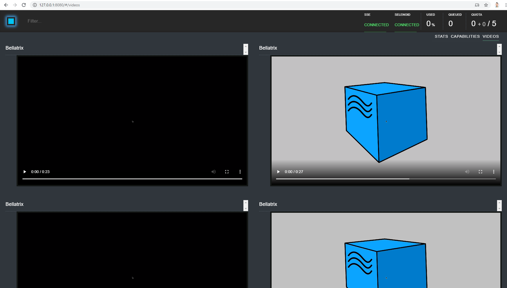

Introduction
-------
 Selenoid is a robust implementation of the Selenium hub using Docker containers to launch browsers. No need to manually install browsers or dive into WebDriver documentation. Any browser session can be saved to the H.264 video. An API to list, download, and delete saved log files. Suitable for personal usage and in big clusters.
- Consumes 10 times less memory than Java-based Selenium server under the same load
- Small 6 Mb binary with no external dependencies (no need to install Java)
- Browser consumption API working out of the box
- Ability to send browser logs to centralized log storage
- Fully isolated and reproducible environment

[Detailed documentation](http://aerokube.com/selenoid/latest/)
[GitHub](https://github.com/aerokube/selenoid)


## Windows Setup ##
1. **[Install Docker](https://docs.docker.com/docker-for-windows/install/)**
2. Download **[Selenoid Configuration Manager](http://aerokube.com/cm/latest/)**
3. Run one command to start Selenoid
```
./cm selenoid start --vnc
```
4. Optionally run one more command to start Selenoid UI
```
./cm selenoid-ui start
```

If you enable the video recording, you can search and watch the videos in Selenoid UI on http://127.0.0.1:8080/#/videos
To check the current local Selenoid hub status navigate to http://127.0.0.1:4444/status



Example
-------
```csharp
[TestFixture]
[Selenoid(BrowserType.Chrome, "77", Lifecycle.RestartEveryTime, recordVideo: true, enableVnc: true, saveSessionLogs: true)]
public class SeleniumGridTests : WebTest
{
    [Test]
    public void PromotionsPageOpened_When_PromotionsButtonClicked()
    {
        App.NavigationService.Navigate("http://demos.bellatrix.solutions/");

        var promotionsLink = App.Components.CreateByLinkText<Anchor>("Promotions");

        promotionsLink.Click();
    }

    [Test]
    [Selenoid(BrowserType.Chrome, "76", Lifecycle.RestartEveryTime, recordVideo: true, enableVnc: true,  saveSessionLogs: false)]
    public void BlogPageOpened_When_PromotionsButtonClicked()
    {
        App.NavigationService.Navigate("http://demos.bellatrix.solutions/");

        var blogLink = App.Components.CreateByLinkText<Anchor>("Blog");

        blogLink.Click();
    }
}
```

Explanations
------------
```csharp
[Selenoid(BrowserType.Chrome, "77", Lifecycle.RestartEveryTime, recordVideo: true, enableVnc: true, saveSessionLogs: true)]
```
To use BELLATRIX with Selenoid, you should use the **Selenoid** attribute instead of Browser. **Selenoid** has the same parameters as Browser but adds to additional ones- browser version, record video and save logs. As with the Browser attribute you can override the class behavior on Test level.
```csharp
[Test]
[Selenoid(BrowserType.Chrome, "76", Lifecycle.RestartEveryTime, recordVideo: true, enableVnc: true,  saveSessionLogs: false)]
public void BlogPageOpened_When_PromotionsButtonClicked()
{
    App.NavigationService.Navigate("http://demos.bellatrix.solutions/");

    var blogLink = App.Components.CreateByLinkText<Anchor>("Blog");

    blogLink.Click();
}
```
As mentioned if you use the Selenoid attribute on method level it overrides the class settings.
```csharp
[Selenoid(BrowserType.Chrome, "76", 1000, 500, Lifecycle.RestartEveryTime)]
```
```csharp
[Selenoid(BrowserType.Chrome, "76", MobileWindowSize._320_568, Lifecycle.RestartEveryTime)]
```
```csharp
[Selenoid(BrowserType.Chrome, "76", TabletWindowSize._600_1024, Lifecycle.RestartEveryTime)]
```
As you can see with the Remote attribute we can change the browser window size again.

Configuration
-------------
If you don't use the attribute, the default information from the configuration will be used placed under the executionSettings section. Also, you can add additional driver arguments under the arguments section array in the configuration file.
```json
"executionSettings": {
  "executionType": "regular",
  "defaultBrowser": "chrome",
  "defaultLifeCycle": "restart every time",
  "resolution": "1920x1080",
  "browserVersion": "91",
  "url": "http://127.0.0.1:4444/wd/hub",
    "arguments": [
    {
        "name": "{runName}",
        "videoName": "{runName}.{timestamp}.mp4",
        "logName": "{runName}.{timestamp}.log",
        "enableVNC": "true",
        "enableVideo": "true",
        "enableLog": "true",
        "screenResolution": "1920x1080x24"
    }
   ]
}
```
Check out the Azure Key Vault integration for information on safely storing secrets such as usernames and passwords. [**Learn more**](/product-integrations/azure-key-vault/)