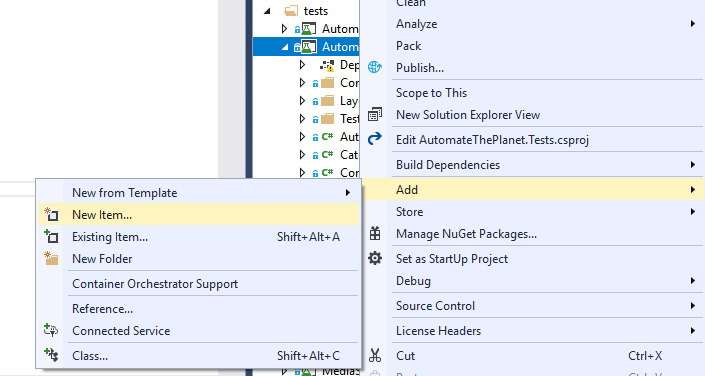
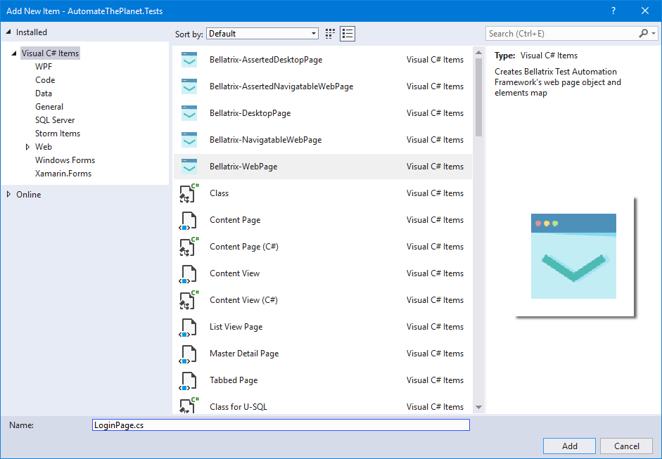

Introduction
------------
As you most probably noticed this is like the 4th time we use almost the same elements and logic inside our tests. Similar test writing approach leads to unreadable and hard to maintain tests.
Because of that people use the so-called Page Object design pattern to reuse their elements and pages' logic. BELLATRIX comes with powerful built-in page objects which are much more readable and maintainable than regular vanilla WebDriver ones.

Non-page-object Test Example
----------------------------
```csharp
[TestMethod]
public void PurchaseRocketWithoutPageObjects()
{
    App.NavigationService.Navigate("http://demos.bellatrix.solutions/");

    // Home page elements
    Select sortDropDown = App.ElementCreateService.CreateByNameEndingWith<Select>("orderby");
    Anchor protonMReadMoreButton = App.ElementCreateService.CreateByInnerTextContaining<Anchor>("Read more");
    Anchor addToCartFalcon9 = App.ElementCreateService.CreateByAttributesContaining<Anchor>("data-product_id", "28").ToBeClickable();
    Anchor viewCartButton = App.ElementCreateService.CreateByClassContaining<Anchor>("added_to_cart wc-forward").ToBeClickable();

    // Home Page actions
    sortDropDown.SelectByText("Sort by price: low to high");
    protonMReadMoreButton.Hover();
    addToCartFalcon9.Focus();
    addToCartFalcon9.Click();
    viewCartButton.Click();

    // Cart page elements
    TextField couponCodeTextField = App.ElementCreateService.CreateById<TextField>("coupon_code");
    Button applyCouponButton = App.ElementCreateService.CreateByValueContaining<Button>("Apply coupon");
    Div messageAlert = App.ElementCreateService.CreateByClassContaining<Div>("woocommerce-message");
    Number quantityBox = App.ElementCreateService.CreateByClassContaining<Number>("input-text qty text");
    Button updateCart = App.ElementCreateService.CreateByValueContaining<Button>("Update cart").ToBeClickable();
    Span totalSpan = App.ElementCreateService.CreateByXpath<Span>("//*[@class='order-total']//span");
    Anchor proceedToCheckout = App.ElementCreateService.CreateByClassContaining<Anchor>("checkout-button button alt wc-forward");

    // Cart page actions
    couponCodeTextField.SetText("happybirthday");
    applyCouponButton.Click();
    messageAlert.ToHasContent().ToBeVisible().WaitToBe();
    messageAlert.EnsureInnerTextIs("Coupon code applied successfully.");

    quantityBox.SetNumber(0);
    quantityBox.SetNumber(2);
    updateCart.Click();
    totalSpan.EnsureInnerTextIs("95.00€", 15000);
    proceedToCheckout.Click();

    // Checkout page elements
    Heading billingDetailsHeading = App.ElementCreateService.CreateByInnerTextContaining<Heading>("Billing details");
    Anchor showLogin = App.ElementCreateService.CreateByInnerTextContaining<Anchor>("Click here to login");
    TextArea orderCommentsTextArea = App.ElementCreateService.CreateById<TextArea>("order_comments");
    TextField billingFirstName = App.ElementCreateService.CreateById<TextField>("billing_first_name");
    TextField billingLastName = App.ElementCreateService.CreateById<TextField>("billing_last_name");
    TextField billingCompany = App.ElementCreateService.CreateById<TextField>("billing_company");
    Select billingCountry = App.ElementCreateService.CreateById<Select>("billing_country");
    TextField billingAddress1 = App.ElementCreateService.CreateById<TextField>("billing_address_1");
    TextField billingAddress2 = App.ElementCreateService.CreateById<TextField>("billing_address_2");
    TextField billingCity = App.ElementCreateService.CreateById<TextField>("billing_city");
    Select billingState = App.ElementCreateService.CreateById<Select>("billing_state").ToBeVisible().ToBeClickable();
    TextField billingZip = App.ElementCreateService.CreateById<TextField>("billing_postcode");
    Phone billingPhone = App.ElementCreateService.CreateById<Phone>("billing_phone");
    Email billingEmail = App.ElementCreateService.CreateById<Email>("billing_email");
    CheckBox createAccountCheckBox = App.ElementCreateService.CreateById<CheckBox>("createaccount");
    RadioButton checkPaymentsRadioButton = App.ElementCreateService.CreateByAttributesContaining<RadioButton>("for", "payment_method_cheque");

    // Checkout page actions
    billingDetailsHeading.ToBeVisible().WaitToBe();
    showLogin.EnsureHrefIs("http://demos.bellatrix.solutions/checkout/#");
    showLogin.EnsureCssClassIs("showlogin");
    orderCommentsTextArea.ScrollToVisible();
    orderCommentsTextArea.SetText("Please send the rocket to my door step! And don't use the elevator, they don't like when it is not clean...");
    billingFirstName.SetText("In");
    billingLastName.SetText("Deepthought");
    billingCompany.SetText("Automate The Planet Ltd.");
    billingCountry.SelectByText("Bulgaria");
    billingAddress1.EnsurePlaceholderIs("House number and street name");
    billingAddress1.SetText("bul. Yerusalim 5");
    billingAddress2.SetText("bul. Yerusalim 6");
    billingCity.SetText("Sofia");
    billingState.SelectByText("Sofia-Grad");
    billingZip.SetText("1000");
    billingPhone.SetPhone("+00359894646464");
    billingEmail.SetEmail("info@bellatrix.solutions");
    createAccountCheckBox.Check();
    checkPaymentsRadioButton.Click();
}
```

How to Create BELLATRIX Page Object
-----------------------------------
To create a new page object, you have a couple of options. You can create it manually. However, why wasting time? BELLATRIX comes with ready-to-go page object templates.
- Create a new folder for your page and name it properly.
- Open the context menu and click 'New Item...'


- Choose one of the 3 web page objects templates
	- Bellatrix-AssertedNavigatableWebPage - contains 3 files- one for actions, one for element declarations and one for assertions (all of them make one-page object)
	- Bellatrix-NavigatableWebPage- one for actions and one for elements (all of them make a one-page object)
	- Bellatrix-WebPage- one for actions and one for elements (all of them make a one-page object), don't have methods for navigation



The files are generated.


- On most pages, you need to define elements. Placing them in a single place makes the changing of the locators easy. It is a matter of choice whether to have action methods or not. If you use the same combination of same actions against a group of elements then it may be a good idea to wrap them in a page object action method. In our example, we can wrap the filling the billing info such a method. 
- In the assertions file, we may place some predefined ensure methods. For example, if you always check the same email or title of a page, there is no need to hardcode the string in each test. Later if the title is changed, you can do it in a single place. The same is true about most of the things you can assert in your tests.

There are navigatable, and non-navigatable page objects since some pages are only part of a workflow, and you access them not via URL but after clicking some link or button. The same is valid if you work with single page applications.

Page Object Example
-------------------
### Methods File ###
```csharp
public partial class CartPage : AssertedNavigatablePage
{
    private const string CouponSuccessfullyAdded = @"Coupon code applied successfully.";

    public override string Url => "http://demos.bellatrix.solutions/cart/";

    public void ApplyCoupon(string coupon)
    {
        CouponCode.SetText(coupon);
        ApplyCouponButton.Click();
        MessageAlert.ToHasContent().ToBeVisible().WaitToBe();

        MessageAlert.EnsureInnerTextIs(CouponSuccessfullyAdded);
    }

    public void UpdateProductQuantity(int productNumber, int newQuantity)
    {
        if (productNumber > QuantityBoxes.Count())
        {
            throw new ArgumentException("There are less added items in the cart. Please specify smaller product number.");
        }

        var browserService = new BrowserService();
        browserService.WaitUntilReady();
        QuantityBoxes[productNumber - 1].SetNumber(0);
        QuantityBoxes[productNumber - 1].SetNumber(newQuantity);
        UpdateCart.Click();
    }

    public void UpdateAllProductsQuantity(int newQuantity)
    {
        if (QuantityBoxes.Any())
        {
            throw new ArgumentException("There are no items to be updated.");
        }

        foreach (var currentQuantityBox in QuantityBoxes)
        {
            currentQuantityBox.SetNumber(0);
            currentQuantityBox.SetNumber(newQuantity);
        }

        UpdateCart.Click();
    }
}
```
### Elements File ###
```csharp
public partial class CartPage
{
    public TextField CouponCode => Element.CreateById<TextField>("coupon_code");
    public Button ApplyCouponButton => Element.CreateByValueContaining<Button>("Apply coupon");
    public Div MessageAlert => Element.CreateByClassContaining<Div>("woocommerce-message");
    public ElementsList<Number> QuantityBoxes => Element.CreateAllByClassContaining<Number>("input-text qty text");
    public Button UpdateCart => Element.CreateByValueContaining<Button>("Update cart").ToBeClickable();
    public Span TotalSpan => Element.CreateByXpath<Span>("//*[@class='order-total']//span");
    public Anchor ProceedToCheckout => Element.CreateByClassContaining<Anchor>("checkout-button button alt wc-forward");
}
```
### Assertions File ###
```csharp
public partial class CartPage
{
    public void AssertTotalPrice(string price)
    {
        TotalSpan.EnsureInnerTextIs($"{price}€", 15000);
    }
}
```

Page Object Example Explanations
--------------------------------
```csharp
public partial class CartPage : AssertedNavigatablePage
```
All BELLATRIX page objects are implemented as partial classes which means that you have separate files for different parts of it- actions, elements, assertions but at the end, they are all built into a single type. This makes the maintainability and readability of these classes much better. Also, you can easier locate what you need. You can always create BELLATRIX page objects yourself inherit one of the 3 classes- AssertedNavigatablePage, NavigatablePage, Page. We advise you to follow the convention with partial classes, but you are always free to put all pieces in a single file.
```csharp
public override string Url => "http://demos.bellatrix.solutions/cart/";
```
Overriding the Url property that comes from the base page object you can later you the Open method to go to the page.
```csharp
public void ApplyCoupon(string coupon)
{
    CouponCode.SetText(coupon);
    ApplyCouponButton.Click();
    MessageAlert.ToHasContent().ToBeVisible().WaitToBe();
    
    MessageAlert.EnsureInnerTextIs(CouponSuccessfullyAdded);
}
```
These elements are always used together when coupon is applied. There are many test cases where you need to apply different coupons and so on. This way you reuse the code instead of copy-paste it. If there is a change in the way how the coupon is applied, change the workflow only here. Even single line of code is changed in your tests.
Usually, it is not entirely correct to make assertions inside action methods. However, ensure methods are just waiting for something to happen.
```csharp
public void UpdateProductQuantity(int productNumber, int newQuantity)
{
    if (productNumber > QuantityBoxes.Count())
    {
        throw new ArgumentException("There are less added items in the cart. Please specify smaller product number.");
    }

    var browserService = new BrowserService();
    browserService.WaitUntilReady();
    QuantityBoxes[productNumber - 1].SetNumber(0);
    QuantityBoxes[productNumber - 1].SetNumber(newQuantity);
    UpdateCart.Click();
}
```
Another method that we can add here is the one for updating the quantity of a product. This is an excellent place to put validations in your code. Here we make sure that the specified number of products that we want to update exists.
CreateAll method returns a special BELLATRIX collection called ElementsList<TElementType> in this case ElementList<Number>. The collection has a couple of useful methods- Count, implements index which we use here.
```csharp
foreach (var currentQuantityBox in QuantityBoxes)
{
    currentQuantityBox.SetNumber(0);
    currentQuantityBox.SetNumber(newQuantity);
}
```
Also, you can use ElementList<T> directly in foreach statements since it implements IEnumerator interface.
```csharp
public TextField CouponCode => Element.CreateById<TextField>("coupon_code");
```
All elements are placed inside the file **PageName.Elements** so that the declarations of your elements to be in a single place. It is convenient since if there is a change in some of the locators or elements types you can apply the fix only here. All elements are implements as properties. Here we use the short syntax for declaring properties, but you can always use the old one. **Elements** property is actually a shorter version of **ElementCreateService**.
```csharp
public ElementsList<Number> QuantityBoxes => Element.CreateAllByClassContaining<Number>("input-text qty text");
```
If you want to find multiple elements, you can use the special BELLATRIX collection ElementsList<TElementType>. You can read more about it in the actions file.
```csharp
public void AssertTotalPrice(string price)
{
    TotalSpan.EnsureInnerTextIs($"{price}€", 15000);
}
```
With this Assert, reuse the formatting of the currency and the timeout. Also, since the method is called from the page it makes your tests a little bit more readable.If there is a change what needs to be checked --> for example, not span but different element you can change it in a single place.

Page Object Test Example
------------------------
```csharp
[TestMethod]
public void PurchaseRocketWithPageObjects()
{
var homePage = App.GoTo<HomePage>();

homePage.FilterProducts(ProductFilter.Popularity);
homePage.AddProductById(28);
homePage.ViewCartButton.Click();

var cartPage = App.Create<CartPage>();

cartPage.ApplyCoupon("happybirthday");
cartPage.UpdateProductQuantity(1, 2);
cartPage.AssertTotalPrice("95.00");
cartPage.ProceedToCheckout.Click();

var billingInfo = new BillingInfo
                      {
                          FirstName = "In",
                          LastName = "Deepthought",
                          Company = "Automate The Planet Ltd.",
                          Country = "Bulgaria",
                          Address1 = "bul. Yerusalim 5",
                          Address2 = "bul. Yerusalim 6",
                          City = "Sofia",
                          State = "Sofia-Grad",
                          Zip = "1000",
                          Phone = "+00359894646464",
                          Email = "info@bellatrix.solutions",
                          ShouldCreateAccount = true,
                          OrderCommentsTextArea = "cool product",
                      };

var checkoutPage = App.Create<CheckoutPage>();
checkoutPage.FillBillingInfo(billingInfo);
checkoutPage.CheckPaymentsRadioButton.Click();
}
```

Page Object Test Example Explanations
-------------------------------------
```csharp
var homePage = App.GoTo<HomePage>();
```
You can use the App GoTo method to navigate to the page and gets an instance of it.
```csharp
homePage.FilterProducts(ProductFilter.Popularity);
homePage.AddProductById(28);
homePage.ViewCartButton.Click();
```
After you have the instance, you can directly start using the action methods of the page. As you can see the test became much shorter and more readable. The additional code pays off in future when changes are made to the page, or you need to reuse some of the methods.
```csharp
var cartPage = App.Create<CartPage>();
```
Navigate to the shopping cart page by clicking the view cart button, so we do not have to call the GoTo method. But we still need an instance. We can get only an instance of the page through the App Create method.
```csharp
cartPage.ApplyCoupon("happybirthday");
cartPage.UpdateProductQuantity(1, 2);
cartPage.AssertTotalPrice("95.00");
cartPage.ProceedToCheckout.Click();
```
Removing all elements and some implementation details from the test made it much more clear and readable. This is one of the strategies to follow for long-term successful automated testing.
```csharp
var billingInfo = new BillingInfo
                  {
                      FirstName = "In",
                      LastName = "Deepthought",
                      Company = "Automate The Planet Ltd.",
                      Country = "Bulgaria",
                      Address1 = "bul. Yerusalim 5",
                      Address2 = "bul. Yerusalim 6",
                      City = "Sofia",
                      State = "Sofia-Grad",
                      Zip = "1000",
                      Phone = "+00359894646464",
                      Email = "info@bellatrix.solutions",
                      ShouldCreateAccount = true,
                      OrderCommentsTextArea = "cool product",
                  };
```
You can move the creation of the data objects in a separate factory method or class.